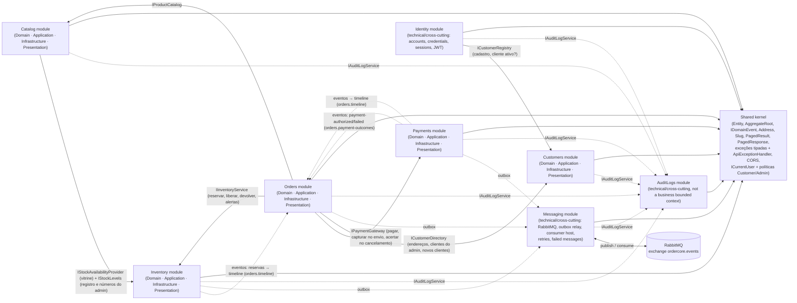

# Visão geral dos módulos

Diagrama leve, só com a direção de dependência entre módulos (via Application Contracts, nunca acessando Domain/Infrastructure alheios). Serve como mapa para navegar até o diagrama detalhado de cada módulo.

As setas cheias são chamadas síncronas (um adapter do módulo consumidor chama um use case do dono). As tracejadas marcadas "eventos" passam pelo RabbitMQ: o módulo grava o evento no próprio outbox, o módulo Messaging publica, e o consumidor recebe numa fila própria, com inbox e retentativas — ver [09-messaging.md](09-messaging.md).

```mermaid
graph LR
    Customers["Customers module\n(Domain · Application · Infrastructure · Presentation)"]
    Catalog["Catalog module\n(Domain · Application · Infrastructure · Presentation)"]
    Inventory["Inventory module\n(Domain · Application · Infrastructure · Presentation)"]
    Orders["Orders module\n(Domain · Application · Infrastructure · Presentation)"]
    Payments["Payments module\n(Domain · Application · Infrastructure · Presentation)"]
    AuditLogs["AuditLogs module\n(technical/cross-cutting, not a business bounded context)"]
    Identity["Identity module\n(technical/cross-cutting: accounts, credentials, sessions, JWT)"]
    Messaging["Messaging module\n(technical/cross-cutting: RabbitMQ, outbox relay, consumer host,\nretries, failed messages)"]
    Broker[("RabbitMQ\nexchange ordercore.events")]
    Shared["Shared kernel\n(Entity, AggregateRoot, IDomainEvent, Address, Slug, PagedResult, PagedResponse,\nexceções tipadas + ApiExceptionHandler, CORS,\nICurrentUser + políticas Customer/Admin)"]

    Orders -->|IProductCatalog| Catalog
    Orders -->|"IInventoryService (reservar, liberar, devolver, alertas)"| Inventory
    Orders -->|"IPaymentGateway (pagar, capturar no envio, acertar no cancelamento)"| Payments
    Orders -->|"ICustomerDirectory (endereços, clientes do admin, novos clientes)"| Customers
    Catalog -->|"IStockAvailabilityProvider (vitrine) + IStockLevels (registro e números do admin)"| Inventory
    Payments -.->|"eventos: payment-authorized/failed (orders.payment-outcomes)"| Orders
    Payments -.->|"eventos → timeline (orders.timeline)"| Orders
    Inventory -.->|"eventos: reservas → timeline (orders.timeline)"| Orders
    Payments -.->|outbox| Messaging
    Orders -.->|outbox| Messaging
    Inventory -.->|outbox| Messaging
    Messaging <-->|publish / consume| Broker
    Messaging -.->|IAuditLogService| AuditLogs
    Orders -.->|IAuditLogService| AuditLogs
    Payments -.->|IAuditLogService| AuditLogs
    Inventory -.->|IAuditLogService| AuditLogs
    Catalog -.->|IAuditLogService| AuditLogs
    Customers -.->|IAuditLogService| AuditLogs
    Identity -->|"ICustomerRegistry (cadastro, cliente ativo?)"| Customers
    Identity -.->|IAuditLogService| AuditLogs

    Customers --> Shared
    Catalog --> Shared
    Inventory --> Shared
    Orders --> Shared
    Payments --> Shared
    AuditLogs --> Shared
    Identity --> Shared
    Messaging --> Shared
```

## Diagramas detalhados (um por módulo, cada um pequeno o suficiente para renderizar)

1. [Shared kernel](01-shared-kernel.md) — `Entity`, `AggregateRoot`, `IDomainEvent`, value objects, dispatcher de eventos, contrato de erros (exceções tipadas → `ProblemDetails`), CORS.
2. [Customers](02-customers.md) — cliente, endereços, métodos de pagamento salvos.
3. [Catalog](03-catalog.md) — categorias, produtos, imagens, variações, listagem da vitrine e produto por slug.
4. [Inventory](04-inventory.md) — saldo de estoque, reservas e consulta de disponibilidade.
5. [Orders](05-orders.md) — pedido, itens, ciclo de vida completo (preparo, envio com captura, entrega, cancelamento com acerto do pagamento), checkout em um passo, cotação do carrinho, lista/detalhe do admin e dashboard, adapters para os outros módulos.
6. [Payments](06-payments.md) — pagamento (com forma de pagamento), captura, void, estornos, acerto no cancelamento, outbox de eventos de integração.
7. [AuditLogs](07-auditlogs.md) — registro de ações via `IAuditLogService`, persistido no PostgreSQL, listagem paginada filtrável por entidade, autor e ação.
8. [Identity](08-identity.md) — contas (cliente/admin), senhas, sessões de refresh e emissão/validação dos JWT.
9. [Messaging](09-messaging.md) — eventos de integração pelo RabbitMQ: outbox por módulo, relay, consumidores com inbox e retentativas, trace nas mensagens e as mensagens que falharam no backoffice.

Todos os diagramas refletem código já implementado; cada um lista, no topo, onde o código difere do desenho original e o que foi acrescentado depois (o MVP do storefront, `Docs/specs/storefront/storefront-api-mvp.md`; a autenticação, `Docs/specs/identity/authentication-and-account.md`; o backoffice, `Docs/specs/backoffice/backoffice-api.md`). Todas as setas novas do backoffice seguem as direções que já existiam: nenhum módulo passou a depender de um que dependa dele.

Cada arquivo é autocontido: quando um módulo depende de outro (ex.: Orders → Catalog), a classe externa aparece como um "stub" marcado `<<external>>`, só com a assinatura que importa para aquele módulo — o detalhe completo dela está no arquivo do módulo dono.
