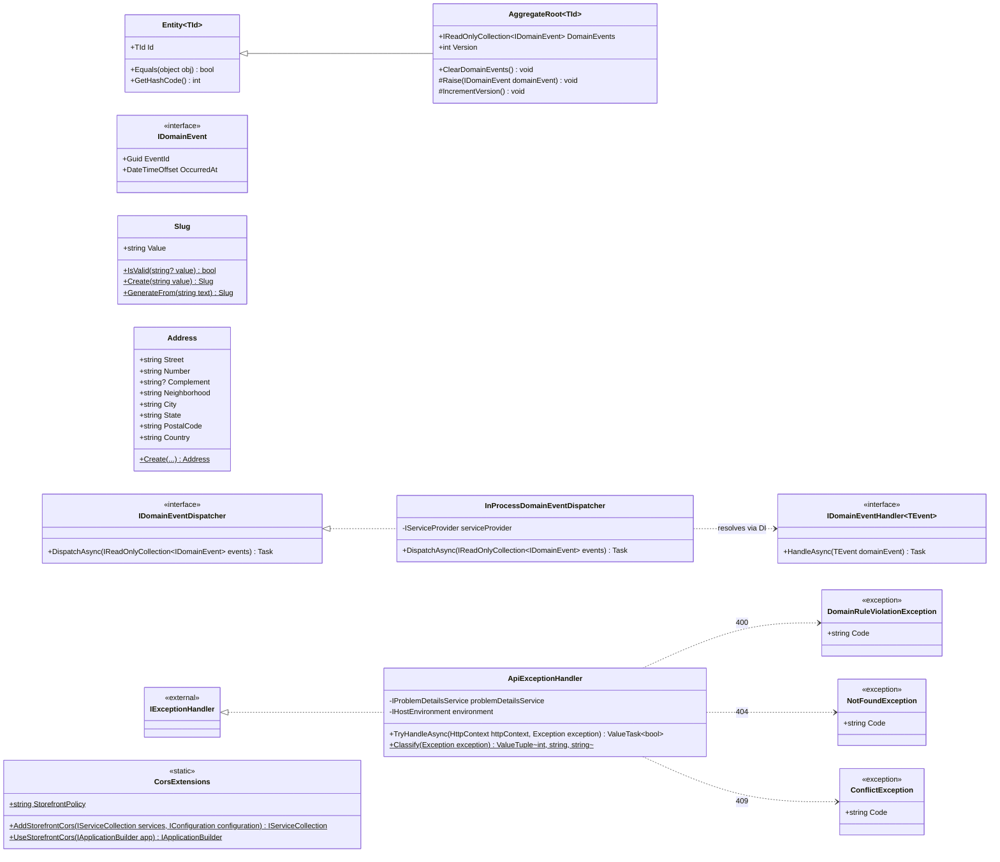

# Shared kernel

Base usada por todos os módulos: identidade/igualdade de entidades, agregados com eventos de domínio, value objects reutilizáveis e o mecanismo que despacha os eventos de domínio para quem precisa reagir a eles (ex.: o projetor de histórico de status do Orders — ver [05-orders.md](05-orders.md)).

## Quem usa o quê

- `AggregateRoot<TId>` é a base de `Customer`, `Product`/`Category`, `StockItem`/`InventoryReservation`, `Order` e `Payment` — ver o diagrama de cada módulo.
- `Address` é usada por `CustomerAddress` (Customers) e por `Order.ShippingAddress`/`Order.BillingAddress` (Orders).
- `Slug` é usada por `Product` e `Category` (Catalog).
- `IDomainEventDispatcher`/`IDomainEventHandler<T>` são implementados por `EfOrderRepository` (dispara após salvar) e consumidos pelo `OrderStatusHistoryProjector` — ver [05-orders.md](05-orders.md).
- `Slug.IsValid` é usado por `GetProductBySlugUseCase` (Catalog) para tratar um slug mal formado vindo da rota como "não encontrado", não como erro de validação.

## Contrato de erros

A convenção única de tratamento de erros da API (em vez de try/catch por endpoint). Casos de uso e agregados lançam exceções tipadas, cada uma com um `Code` estável em snake_case; `ApiExceptionHandler` (registrado com `AddProblemDetails`/`AddExceptionHandler` + `UseExceptionHandler` no `Program.cs`) as transforma em `ProblemDetails` (RFC 7807) com a extensão `code`:

| Exceção | Status | `code` |
|---|---|---|
| `DomainRuleViolationException` (Domain — invariante ou máquina de estados) | 400 | o próprio (`invalid_order_state`, `mixed_currencies`, …) |
| `NotFoundException` (Application) | 404 | o próprio (`order_not_found`, `address_not_found`, …) |
| `ConflictException` (Application; não é `sealed`, ex.: `StockConcurrencyConflictException` do Inventory herda dela) | 409 | o próprio (`insufficient_stock`, `price_changed`, …) |
| `DbUpdateConcurrencyException` (EF Core) | 409 | `concurrency_conflict` |
| `ArgumentException` (o que os `Create`/value objects já lançam) | 400 | `validation_error` |
| qualquer outra | 500 | `internal_error`, sem detalhe fora de Development |

`DomainRuleViolationException` fica em `Shared/Domain` para que o Domain de qualquer módulo possa lançá-la sem depender de nada fora do kernel. Os `[ProducesResponseType]` de erro de cada controller declaram `typeof(ProblemDetails)`.

## CORS

`CorsExtensions` registra uma política nomeada (`Storefront`) cujas origens vêm só de `Cors:AllowedOrigins` na configuração (`http://localhost:3000` no `appsettings.json`); lista vazia ou ausente não libera nenhuma origem.
