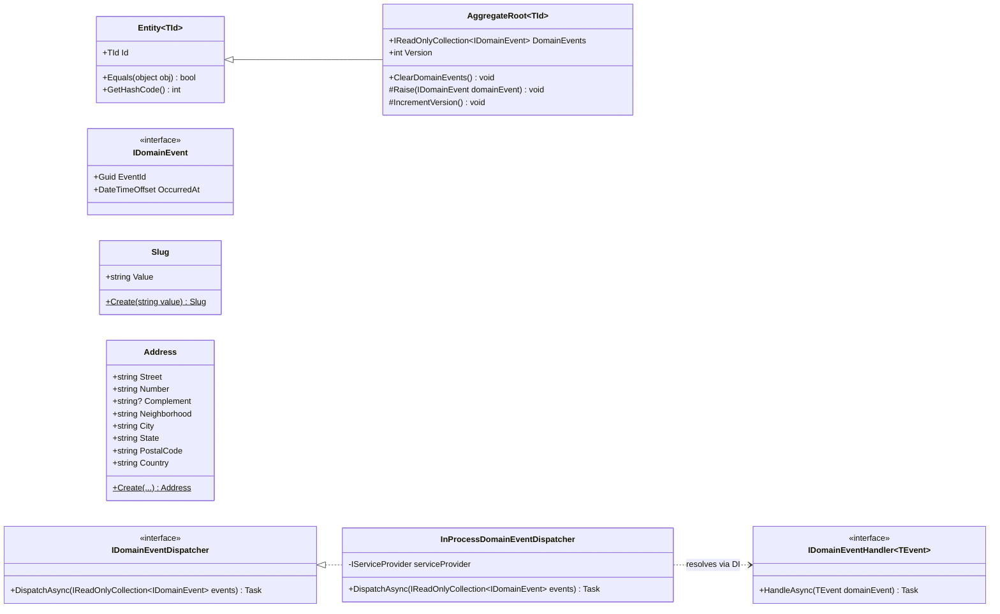

# Shared kernel

Base usada por todos os módulos: identidade/igualdade de entidades, agregados com eventos de domínio, value objects reutilizáveis e o mecanismo que despacha os eventos de domínio para quem precisa reagir a eles (ex.: o projetor de histórico de status do Orders — ver [05-orders.md](05-orders.md)).

## Quem usa o quê

- `AggregateRoot<TId>` é a base de `Customer`, `Product`/`Category`, `StockItem`/`InventoryReservation`, `Order` e `Payment` — ver o diagrama de cada módulo.
- `Address` é usada por `CustomerAddress` (Customers) e por `Order.ShippingAddress`/`Order.BillingAddress` (Orders).
- `Slug` é usada por `Product` e `Category` (Catalog).
- `IDomainEventDispatcher`/`IDomainEventHandler<T>` são implementados por `EfOrderRepository` (dispara após salvar) e consumidos pelo `OrderStatusHistoryProjector` — ver [05-orders.md](05-orders.md).
