# Módulo Customers

Cadastro de clientes, endereços salvos e métodos de pagamento tokenizados. Base: [Shared kernel](01-shared-kernel.md) (`AggregateRoot<Guid>`, `Address`).

Diferente da maioria dos diagramas desta pasta, este módulo já está **implementado** de ponta a ponta (Domain, Application, Infrastructure/EF Core e Presentation) — não é mais um blueprint futuro. `CustomersEndpoints` (minimal API estática) foi substituído por `CustomersController` ([ApiController]) ao implementar, para seguir a mesma convenção já usada por `AuditLogsController` em vez de introduzir um segundo padrão de Presentation (seção 33 do contexto do projeto). Outras diferenças entre este diagrama e o código, todas documentadas nos comentários das classes correspondentes:

- `Customer.Create`/`CustomerPaymentMethod.Create` recebem um `now` explícito (como `Order.Create`), já que `CreatedAt`/`UpdatedAt` precisam de um valor e o domínio não deve ler o relógio sozinho.
- `RegisterCustomerCommand`/`RegisterCustomerRequest` incluem `PasswordHash` (placeholder até existir um módulo de autenticação real com hashing no servidor) e `AddCustomerAddressCommand`/`AddCustomerAddressRequest` incluem todos os campos de `Address` (não só Street/City/State/PostalCode), já que `Address.Create` exige todos eles.
- `Customer`, `CustomerAddress` e `CustomerPaymentMethod` ganharam um factory `internal static Rehydrate(...)`, distinto de `Create`, para que `CustomerMapper` reconstrua o agregado a partir do banco sem re-levantar `CustomerRegistered`.
- `CustomerAddressPersistenceModel` guarda todos os campos de `Address` (não só Street/City/State/PostalCode) pelo mesmo motivo.
- **Endereços no checkout** (MVP do storefront, `Docs/specs/storefront/storefront-api-mvp.md`, etapa 4): `CustomerAddressResponse` devolve o endereço completo (antes só `Label`/`City`/`IsDefaultShipping`), para o checkout poder mostrar e escolher um endereço salvo; `GetCustomerAddressUseCase` resolve um endereço de um cliente para o checkout do Orders — `customer_not_found`, `address_not_found` (também para o endereço de outro cliente) e `customer_inactive` para cliente desativado.
- `CustomerAddressPersistenceModel.Id`/`CustomerPaymentMethodPersistenceModel.Id` usam `ValueGeneratedNever()`: o id vem do domínio, e sem isso o EF Core tratava um endereço novo num cliente já salvo como linha existente (UPDATE que não afetava nada, 409 na API).

```mermaid

classDiagram
    direction LR

    class AggregateRoot~TId~ {
        <<external>>
    }

    class Address {
        <<external>>
    }

    %% OrderCore.Api.Modules.Customers.Domain.Entities
    class Customer {
        +string Name
        +string Email
        +string? Phone
        +string? DocumentNumber
        +string PasswordHash
        +bool Active
        +DateTimeOffset? EmailVerifiedAt
        +DateTimeOffset CreatedAt
        +DateTimeOffset UpdatedAt
        +IReadOnlyCollection~CustomerAddress~ Addresses
        +IReadOnlyCollection~CustomerPaymentMethod~ PaymentMethods
        +Create(string name, string email, string passwordHash)$ Customer
        +UpdateProfile(string name, string? phone, string? documentNumber) void
        +VerifyEmail(DateTimeOffset now) void
        +Activate() void
        +Deactivate() void
        +AddAddress(CustomerAddress address) void
        +RemoveAddress(Guid addressId) void
        +SetDefaultShippingAddress(Guid addressId) void
        +SetDefaultBillingAddress(Guid addressId) void
        +AddPaymentMethod(CustomerPaymentMethod method) void
        +RemovePaymentMethod(Guid paymentMethodId) void
    }

    class CustomerAddress {
        +string Label
        +string RecipientName
        +string? Phone
        +Address Address
        +bool IsDefaultShipping
        +bool IsDefaultBilling
        +DateTimeOffset CreatedAt
        +DateTimeOffset UpdatedAt
        +Create(string label, string recipientName, string? phone, Address address, DateTimeOffset now)$ CustomerAddress
        +UpdateContactInfo(string recipientName, string? phone) void
        +MarkAsDefaultShipping() void
        +UnmarkAsDefaultShipping() void
        +MarkAsDefaultBilling() void
        +UnmarkAsDefaultBilling() void
    }

    class CustomerPaymentMethod {
        +string Provider
        +string ProviderCustomerReference
        +string Brand
        +string Last4Digits
        +int ExpiryMonth
        +int ExpiryYear
        +bool IsDefault
        +DateTimeOffset CreatedAt
        +DateTimeOffset UpdatedAt
        +Create(string provider, string providerCustomerReference, string brand, string last4Digits, int expiryMonth, int expiryYear)$ CustomerPaymentMethod
        +IsExpired(DateTimeOffset now) bool
        +MarkAsDefault() void
        +UnmarkAsDefault() void
    }


    %% OrderCore.Api.Modules.Customers.Domain.Events
    class CustomerRegistered {
        +Guid EventId
        +DateTimeOffset OccurredAt
        +Guid CustomerId
        +string Email
    }

    class CustomerAddressAdded {
        +Guid EventId
        +DateTimeOffset OccurredAt
        +Guid CustomerId
        +Guid AddressId
    }


    %% OrderCore.Api.Modules.Customers.Application.Contracts
    class ICustomerRepository {
        <<interface>>
        +GetByIdAsync(Guid customerId) Task~Customer?~
        +GetByEmailAsync(string email) Task~Customer?~
        +AddAsync(Customer customer) Task
        +SaveChangesAsync() Task
    }


    %% OrderCore.Api.Modules.Customers.Application.DTOs
    class RegisterCustomerCommand {
        +string Name
        +string Email
        +string? Phone
        +string? DocumentNumber
    }

    class AddCustomerAddressCommand {
        +Guid CustomerId
        +string Label
        +string RecipientName
        +Address Address
    }

    class CustomerOutput {
        +Guid Id
        +string Name
        +string Email
        +bool Active
    }


    %% OrderCore.Api.Modules.Customers.Application.UseCases
    class RegisterCustomerUseCase {
        -ICustomerRepository customers
        +ExecuteAsync(RegisterCustomerCommand command) Task~CustomerOutput~
    }

    class UpdateCustomerProfileUseCase {
        -ICustomerRepository customers
        +ExecuteAsync(Guid customerId, string name, string? phone) Task~CustomerOutput~
    }

    class AddCustomerAddressUseCase {
        -ICustomerRepository customers
        +ExecuteAsync(AddCustomerAddressCommand command) Task~Guid~
    }

    class ListCustomerAddressesUseCase {
        -ICustomerRepository customers
        +ExecuteAsync(Guid customerId) Task~IReadOnlyList~CustomerAddress~~
    }

    class GetCustomerByIdUseCase {
        -ICustomerRepository customers
        +ExecuteAsync(Guid customerId) Task~CustomerOutput~
    }

    class GetCustomerAddressUseCase {
        -ICustomerRepository customers
        +ExecuteAsync(Guid customerId, Guid addressId) Task~CustomerAddress~
    }


    %% OrderCore.Api.Modules.Customers
    class CustomersDependencyInjection {
        <<static>>
        +AddCustomersModule(IServiceCollection services)$ IServiceCollection
    }


    %% OrderCore.Api.Modules.Customers.Infrastructure.Persistence
    class CustomerPersistenceModel {
        +Guid Id
        +string Name
        +string Email
        +string? Phone
        +bool Active
        +DateTimeOffset CreatedAt
        +DateTimeOffset UpdatedAt
        +ICollection~CustomerAddressPersistenceModel~ Addresses
        +ICollection~CustomerPaymentMethodPersistenceModel~ PaymentMethods
    }

    class CustomerAddressPersistenceModel {
        +Guid Id
        +Guid CustomerId
        +string Label
        +string Street
        +string City
        +string State
        +string PostalCode
        +bool IsDefaultShipping
        +bool IsDefaultBilling
    }

    class CustomerPaymentMethodPersistenceModel {
        +Guid Id
        +Guid CustomerId
        +string Provider
        +string Brand
        +string Last4Digits
        +bool IsDefault
    }

    class CustomerMapper {
        +ToDomain(CustomerPersistenceModel model) Customer
        +ToPersistence(Customer domain) CustomerPersistenceModel
        +ApplyChanges(Customer domain, CustomerPersistenceModel model) void
    }

    class CustomersDbContext {
        +DbSet~CustomerPersistenceModel~ Customers
        +DbSet~CustomerAddressPersistenceModel~ CustomerAddresses
        +DbSet~CustomerPaymentMethodPersistenceModel~ CustomerPaymentMethods
        +SaveChangesAsync() Task~int~
    }

    class EfCustomerRepository {
        -CustomersDbContext dbContext
        -CustomerMapper mapper
    }


    %% OrderCore.Api.Modules.Customers.Presentation
    class CustomersController {
        -RegisterCustomerUseCase registerCustomerUseCase
        -GetCustomerByIdUseCase getCustomerByIdUseCase
        -AddCustomerAddressUseCase addCustomerAddressUseCase
        -ListCustomerAddressesUseCase listCustomerAddressesUseCase
        +RegisterAsync(RegisterCustomerRequest request) Task~ActionResult~CustomerResponse~~
        +GetByIdAsync(Guid id) Task~ActionResult~CustomerResponse~~
        +AddAddressAsync(Guid id, AddCustomerAddressRequest request) Task~IActionResult~
        +ListAddressesAsync(Guid id) Task~ActionResult~IReadOnlyList~CustomerAddressResponse~~~
    }

    class RegisterCustomerRequest {
        +string Name
        +string Email
        +string? Phone
    }

    class AddCustomerAddressRequest {
        +string Label
        +string RecipientName
        +string Street
        +string City
        +string State
        +string PostalCode
    }

    class CustomerResponse {
        +Guid Id
        +string Name
        +string Email
        +bool Active
    }

    class CustomerAddressResponse {
        +Guid Id
        +string Label
        +string RecipientName
        +string? Phone
        +string Street
        +string Number
        +string? Complement
        +string Neighborhood
        +string City
        +string State
        +string PostalCode
        +string Country
        +bool IsDefaultShipping
        +bool IsDefaultBilling
    }

    class CustomerPresenter {
        +ToResponse(CustomerOutput output) CustomerResponse
        +ToResponse(CustomerAddress address) CustomerAddressResponse
    }


    AggregateRoot~TId~ <|-- Customer
    IDomainEvent <|.. CustomerRegistered
    IDomainEvent <|.. CustomerAddressAdded
    Customer "1" *-- "0..*" CustomerAddress
    Customer "1" *-- "0..*" CustomerPaymentMethod
    CustomerAddress --> Address
    Customer ..> CustomerRegistered : raises
    Customer ..> CustomerAddressAdded : raises

    RegisterCustomerUseCase --> ICustomerRepository
    UpdateCustomerProfileUseCase --> ICustomerRepository
    AddCustomerAddressUseCase --> ICustomerRepository
    GetCustomerByIdUseCase --> ICustomerRepository
    ListCustomerAddressesUseCase --> ICustomerRepository
    GetCustomerAddressUseCase --> ICustomerRepository

    ICustomerRepository <|.. EfCustomerRepository
    EfCustomerRepository --> CustomersDbContext
    EfCustomerRepository --> CustomerMapper
    CustomerMapper --> CustomerPersistenceModel
    CustomerMapper --> Customer
    CustomersDbContext --> CustomerPersistenceModel
    CustomersDbContext --> CustomerAddressPersistenceModel
    CustomersDbContext --> CustomerPaymentMethodPersistenceModel

    CustomersDependencyInjection --> RegisterCustomerUseCase : registers
    CustomersDependencyInjection --> ICustomerRepository : registers

    CustomersController --> RegisterCustomerUseCase
    CustomersController --> GetCustomerByIdUseCase
    CustomersController --> AddCustomerAddressUseCase
    CustomersController --> ListCustomerAddressesUseCase
    CustomersController --> CustomerPresenter
    CustomerPresenter --> CustomerResponse
    CustomerPresenter --> CustomerAddressResponse

```

## Comportamento das entidades filhas

`CustomerAddress` e `CustomerPaymentMethod` deixaram de ser bags de propriedades: `Customer.SetDefaultShippingAddress`/`SetDefaultBillingAddress`/`AddPaymentMethod` delegam para `MarkAsDefaultShipping`/`MarkAsDefaultBilling`/`MarkAsDefault` no filho correspondente (e desmarcam o anterior), em vez de mexer nos campos diretamente a partir do agregado. `CustomerPaymentMethod.IsExpired(now)` existe porque comparar mês/ano de expiração é uma regra de negócio, não um detalhe de apresentação — não deveria ser recalculada em cada lugar que precisa checar isso.

## Paridade com `Docs/database/OrderCore_Modelagem_Banco_Backend.docx`

`PasswordHash` (em `Customer`) e `UpdatedAt` (em `CustomerAddress`) já existiam no documento de modelagem de banco (seção 4.1/4.2) mas não tinham chegado a este diagrama — adicionados agora, junto com o parâmetro `now`/`passwordHash` que faltava nos respectivos `Create` para que os campos possam de fato ser preenchidos. `CustomerPaymentMethod.UpdatedAt` não existia em nenhum dos dois documentos — foi acrescentado em ambos por consistência com toda entidade mutável do sistema (`Customer`, `CustomerAddress`, `Category`, `Product` etc. já rastreiam `updated_at`); mantido como responsabilidade da camada de persistência, sem entrar na assinatura de `MarkAsDefault`/`UnmarkAsDefault`.

## Consumido por outros módulos

- Nenhum outro módulo referencia `Customer` diretamente — `Order.CustomerId` guarda apenas o id (ver [05-orders.md](05-orders.md)), seguindo a mesma regra de isolamento que já existe entre Orders e Payments no código atual.
- **Orders** chama `GetCustomerAddressUseCase` de dentro de um `CustomerDirectoryAdapter` (implementa o `ICustomerDirectory` do Orders) no checkout; só o value object `Address` (shared kernel) atravessa a fronteira — ver [05-orders.md](05-orders.md).
