# Módulo Catalog

Categorias e produtos (com imagens e variações). É o módulo que substitui o `Product` cru atual por uma entidade robusta o suficiente para alimentar vitrine, PDP e busca no front-end. Base: [Shared kernel](01-shared-kernel.md) (`AggregateRoot<Guid>`, `Slug`).

Como [02-customers.md](02-customers.md), este módulo já está **implementado** de ponta a ponta (Domain, Application, Infrastructure/EF Core e Presentation), não é mais um blueprint futuro. Diferenças entre este diagrama e o código, todas documentadas nos comentários das classes correspondentes:

- `Product.ChangePrice`/`AddImage`/`AddVariant` e `Category.Create` recebem um `now`/`description` explícito que faltava na assinatura abreviada do diagrama, pela mesma razão já documentada em `Customer.Create` (02-customers.md).
- `CreateProductCommand`/`CreateProductRequest` ganham `Currency`; `CreateCategoryCommand`/`CreateCategoryRequest` e `UpdateProductRequest` ganham `Description`; `ProductOutput`/`ProductResponse` já tinham `ImageUrls` no diagrama mas nada os preenchia — passou a vir do agregado.
- Nenhuma delas tem um campo de `Slug`: `CreateProductUseCase`/`CreateCategoryUseCase` derivam o slug do nome via `Slug.GenerateFrom` (novo método no shared kernel), em vez do chamador enviar um.
- `ProductPersistenceModel`/`CategoryPersistenceModel` guardam todos os campos das respectivas entidades de domínio (não só o subconjunto abreviado do diagrama), pela mesma razão de `CustomerAddressPersistenceModel`.
- `CategoryMapper` ganhou um `ApplyChanges` que o diagrama não lista — sem ele, `Rename`/`ChangeDisplayOrder`/`Activate`/`Deactivate` nunca seriam persistidos.
- `ChangeProductPriceUseCase` não tem endpoint em `CatalogController`: o diagrama nunca liga esse caso de uso a uma rota, então nenhuma foi criada.

```mermaid

classDiagram
    direction LR

    class AggregateRoot~TId~ {
        <<external>>
    }

    class Slug {
        <<external>>
    }

    %% OrderCore.Api.Modules.Catalog.Domain.Entities
    class Category {
        +string Name
        +Slug Slug
        +Guid? ParentCategoryId
        +string? Description
        +int DisplayOrder
        +bool Active
        +DateTimeOffset CreatedAt
        +DateTimeOffset UpdatedAt
        +Create(string name, Slug slug, Guid? parentCategoryId, DateTimeOffset now)$ Category
        +Rename(string name, Slug slug) void
        +ChangeDisplayOrder(int order) void
        +Activate() void
        +Deactivate() void
    }

    class Product {
        +string Sku
        +string Name
        +Slug Slug
        +string? ShortDescription
        +string? Description
        +Guid CategoryId
        +string? Brand
        +decimal CurrentPrice
        +decimal? CompareAtPrice
        +string Currency
        +int? WeightGrams
        +decimal? HeightCm
        +decimal? WidthCm
        +decimal? DepthCm
        +ProductStatus Status
        +bool Active
        +DateTimeOffset? PublishedAt
        +DateTimeOffset CreatedAt
        +DateTimeOffset UpdatedAt
        +IReadOnlyCollection~ProductImage~ Images
        +IReadOnlyCollection~ProductVariant~ Variants
        +Create(string sku, string name, Slug slug, Guid categoryId, decimal currentPrice, string currency, DateTimeOffset now)$ Product
        +ChangePrice(decimal newPrice) void
        +UpdateDetails(string name, string? shortDescription, string? description, string? brand) void
        +Publish(DateTimeOffset now) void
        +Discontinue() void
        +AddImage(string url, string? altText, bool isPrimary) void
        +RemoveImage(Guid imageId) void
        +ReorderImages(IReadOnlyList~Guid~ orderedImageIds) void
        +AddVariant(string sku, string name, string attributesJson, decimal additionalPrice) void
        +RemoveVariant(Guid variantId) void
    }

    class ProductImage {
        +string Url
        +string? AltText
        +int DisplayOrder
        +bool IsPrimary
        +DateTimeOffset CreatedAt
        +Create(string url, string? altText, bool isPrimary, DateTimeOffset now)$ ProductImage
        +ChangeAltText(string? altText) void
        +MarkAsPrimary() void
        +UnmarkAsPrimary() void
    }

    class ProductVariant {
        +string Sku
        +string Name
        +string AttributesJson
        +decimal AdditionalPrice
        +bool Active
        +DateTimeOffset CreatedAt
        +DateTimeOffset UpdatedAt
        +Create(string sku, string name, string attributesJson, decimal additionalPrice, DateTimeOffset now)$ ProductVariant
        +ChangeAdditionalPrice(decimal newAdditionalPrice) void
        +Activate() void
        +Deactivate() void
    }


    %% OrderCore.Api.Modules.Catalog.Domain.Enums
    class ProductStatus {
        <<enumeration>>
        Draft
        Active
        Discontinued
    }


    %% OrderCore.Api.Modules.Catalog.Domain.Events
    class ProductCreated {
        +Guid EventId
        +DateTimeOffset OccurredAt
        +Guid ProductId
    }

    class ProductPriceChanged {
        +Guid EventId
        +DateTimeOffset OccurredAt
        +Guid ProductId
        +decimal OldPrice
        +decimal NewPrice
    }

    class ProductPublished {
        +Guid EventId
        +DateTimeOffset OccurredAt
        +Guid ProductId
    }


    %% OrderCore.Api.Modules.Catalog.Application.Contracts
    class IProductRepository {
        <<interface>>
        +GetByIdAsync(Guid productId) Task~Product?~
        +GetBySkuAsync(string sku) Task~Product?~
        +ListAsync(ListProductsFilter filter) Task~IReadOnlyList~Product~~
        +AddAsync(Product product) Task
        +SaveChangesAsync() Task
    }

    class ICategoryRepository {
        <<interface>>
        +GetByIdAsync(Guid categoryId) Task~Category?~
        +ListAsync() Task~IReadOnlyList~Category~~
        +AddAsync(Category category) Task
        +SaveChangesAsync() Task
    }


    %% OrderCore.Api.Modules.Catalog.Application.DTOs
    class CreateProductCommand {
        +string Sku
        +string Name
        +Guid CategoryId
        +decimal CurrentPrice
        +string Currency
    }

    class UpdateProductCommand {
        +string Name
        +string? ShortDescription
        +string? Description
        +string? Brand
    }

    class ListProductsFilter {
        +Guid? CategoryId
        +bool? Active
        +string? SearchTerm
        +int Page
        +int PageSize
    }

    class ProductOutput {
        +Guid Id
        +string Sku
        +string Name
        +decimal CurrentPrice
        +decimal? CompareAtPrice
        +ProductStatus Status
    }

    class CreateCategoryCommand {
        +string Name
        +Guid? ParentCategoryId
    }

    class CategoryOutput {
        +Guid Id
        +string Name
        +string Slug
    }


    %% OrderCore.Api.Modules.Catalog.Application.UseCases
    class CreateProductUseCase {
        -IProductRepository products
        -ICategoryRepository categories
        +ExecuteAsync(CreateProductCommand command) Task~ProductOutput~
    }

    class UpdateProductUseCase {
        -IProductRepository products
        +ExecuteAsync(Guid productId, UpdateProductCommand command) Task~ProductOutput~
    }

    class ChangeProductPriceUseCase {
        -IProductRepository products
        +ExecuteAsync(Guid productId, decimal newPrice) Task~ProductOutput~
    }

    class PublishProductUseCase {
        -IProductRepository products
        +ExecuteAsync(Guid productId) Task~ProductOutput~
    }

    class GetProductByIdUseCase {
        -IProductRepository products
        +ExecuteAsync(Guid productId) Task~ProductOutput~
    }

    class ListProductsUseCase {
        -IProductRepository products
        +ExecuteAsync(ListProductsFilter filter) Task~IReadOnlyList~ProductOutput~~
    }

    class CreateCategoryUseCase {
        -ICategoryRepository categories
        +ExecuteAsync(CreateCategoryCommand command) Task~CategoryOutput~
    }

    class ListCategoriesUseCase {
        -ICategoryRepository categories
        +ExecuteAsync() Task~IReadOnlyList~CategoryOutput~~
    }


    %% OrderCore.Api.Modules.Catalog
    class CatalogDependencyInjection {
        <<static>>
        +AddCatalogModule(IServiceCollection services)$ IServiceCollection
    }


    %% OrderCore.Api.Modules.Catalog.Infrastructure.Persistence
    class ProductPersistenceModel {
        +Guid Id
        +string Sku
        +string Name
        +string Slug
        +Guid CategoryId
        +decimal CurrentPrice
        +decimal? CompareAtPrice
        +string Status
        +bool Active
        +ICollection~ProductImagePersistenceModel~ Images
        +ICollection~ProductVariantPersistenceModel~ Variants
    }

    class ProductImagePersistenceModel {
        +Guid Id
        +Guid ProductId
        +string Url
        +int DisplayOrder
        +bool IsPrimary
    }

    class ProductVariantPersistenceModel {
        +Guid Id
        +Guid ProductId
        +string Sku
        +decimal AdditionalPrice
    }

    class CategoryPersistenceModel {
        +Guid Id
        +string Name
        +string Slug
        +Guid? ParentCategoryId
        +bool Active
    }

    class ProductMapper {
        +ToDomain(ProductPersistenceModel model) Product
        +ToPersistence(Product domain) ProductPersistenceModel
        +ApplyChanges(Product domain, ProductPersistenceModel model) void
    }

    class CategoryMapper {
        +ToDomain(CategoryPersistenceModel model) Category
        +ToPersistence(Category domain) CategoryPersistenceModel
    }

    class CatalogDbContext {
        +DbSet~ProductPersistenceModel~ Products
        +DbSet~CategoryPersistenceModel~ Categories
        +SaveChangesAsync() Task~int~
    }

    class EfProductRepository {
        -CatalogDbContext dbContext
        -ProductMapper mapper
    }

    class EfCategoryRepository {
        -CatalogDbContext dbContext
        -CategoryMapper mapper
    }


    %% OrderCore.Api.Modules.Catalog.Presentation
    class CatalogController {
        -CreateProductUseCase createProductUseCase
        -UpdateProductUseCase updateProductUseCase
        -PublishProductUseCase publishProductUseCase
        -GetProductByIdUseCase getProductByIdUseCase
        -ListProductsUseCase listProductsUseCase
        -CreateCategoryUseCase createCategoryUseCase
        -ListCategoriesUseCase listCategoriesUseCase
        +CreateProductAsync(CreateProductRequest request) Task~ActionResult~ProductResponse~~
        +UpdateProductAsync(Guid id, UpdateProductRequest request) Task~ActionResult~ProductResponse~~
        +PublishProductAsync(Guid id) Task~IActionResult~
        +GetProductByIdAsync(Guid id) Task~ActionResult~ProductResponse~~
        +ListProductsAsync(ListProductsFilter filter) Task~ActionResult~IReadOnlyList~ProductResponse~~~
        +CreateCategoryAsync(CreateCategoryRequest request) Task~ActionResult~CategoryResponse~~
        +ListCategoriesAsync() Task~ActionResult~IReadOnlyList~CategoryResponse~~~
    }

    class CreateProductRequest {
        +string Sku
        +string Name
        +Guid CategoryId
        +decimal CurrentPrice
    }

    class UpdateProductRequest {
        +string Name
        +string? ShortDescription
        +string? Brand
    }

    class CreateCategoryRequest {
        +string Name
        +Guid? ParentCategoryId
    }

    class ProductResponse {
        +Guid Id
        +string Sku
        +string Name
        +decimal CurrentPrice
        +decimal? CompareAtPrice
        +string Status
        +IReadOnlyList~string~ ImageUrls
    }

    class CategoryResponse {
        +Guid Id
        +string Name
        +string Slug
    }

    class ProductPresenter {
        +ToResponse(ProductOutput output) ProductResponse
    }

    class CategoryPresenter {
        +ToResponse(CategoryOutput output) CategoryResponse
    }


    AggregateRoot~TId~ <|-- Category
    AggregateRoot~TId~ <|-- Product
    Category "1" o-- "0..*" Category : subcategories
    Category "1" --> "0..*" Product
    Product "1" *-- "0..*" ProductImage
    Product "1" *-- "0..*" ProductVariant
    Product --> ProductStatus
    Product --> Slug
    Category --> Slug
    Product ..> ProductCreated : raises
    Product ..> ProductPriceChanged : raises
    Product ..> ProductPublished : raises

    CreateProductUseCase --> IProductRepository
    CreateProductUseCase --> ICategoryRepository
    UpdateProductUseCase --> IProductRepository
    ChangeProductPriceUseCase --> IProductRepository
    PublishProductUseCase --> IProductRepository
    GetProductByIdUseCase --> IProductRepository
    ListProductsUseCase --> IProductRepository
    CreateCategoryUseCase --> ICategoryRepository
    ListCategoriesUseCase --> ICategoryRepository

    IProductRepository <|.. EfProductRepository
    ICategoryRepository <|.. EfCategoryRepository
    EfProductRepository --> CatalogDbContext
    EfProductRepository --> ProductMapper
    EfCategoryRepository --> CatalogDbContext
    EfCategoryRepository --> CategoryMapper
    ProductMapper --> ProductPersistenceModel
    ProductMapper --> Product
    CategoryMapper --> CategoryPersistenceModel
    CategoryMapper --> Category
    CatalogDbContext --> ProductPersistenceModel
    CatalogDbContext --> CategoryPersistenceModel

    CatalogDependencyInjection --> CreateProductUseCase : registers
    CatalogDependencyInjection --> IProductRepository : registers

    CatalogController --> CreateProductUseCase
    CatalogController --> UpdateProductUseCase
    CatalogController --> PublishProductUseCase
    CatalogController --> ListProductsUseCase
    CatalogController --> CreateCategoryUseCase
    CatalogController --> ProductPresenter
    CatalogController --> CategoryPresenter
    ProductPresenter --> ProductResponse
    CategoryPresenter --> CategoryResponse

```

## Comportamento das entidades filhas

`ProductImage` e `ProductVariant` deixaram de ser bags de propriedades: `Product.AddImage`/`ReorderImages` delegam a promoção/rebaixamento de imagem principal para `MarkAsPrimary`/`UnmarkAsPrimary` no filho, em vez de mexer no campo `IsPrimary` diretamente a partir do agregado. `ProductVariant.Activate`/`Deactivate` permite desligar uma variação específica sem afetar o produto inteiro. `AttributesJson` continua como string por simplicidade nesta fase — se o número de atributos consultados crescer, vale considerar um acessor tipado em vez de expor o JSON bruto para quem consome a entidade.

## Paridade com `Docs/database/OrderCore_Modelagem_Banco_Backend.docx`

O documento de modelagem de banco (seções 5.1-5.4) já especificava `height_cm`/`width_cm`/`depth_cm` em `PRODUCTS` (para cálculo de frete) e `created_at`/`updated_at` em `CATEGORIES`, `PRODUCTS`, `PRODUCT_IMAGES` e `PRODUCT_VARIANTS`, mas nenhum desses campos tinha chegado a este diagrama — adicionados agora, com o parâmetro `now` correspondente nos respectivos `Create` para que `CreatedAt` seja de fato preenchido na criação (`UpdatedAt` fica por conta da camada de persistência a cada gravação, sem precisar entrar na assinatura de cada método de mutação).

`Product.PublishedAt` não existia em nenhum dos dois documentos — foi acrescentado em ambos (aqui e na seção 5.2 do docx) seguindo o mesmo padrão que `Order.ConfirmedAt`/`CancelledAt` já usa: a transição `Publish()` passou a receber `DateTimeOffset now` para poder registrar quando o produto saiu de `Draft` para `Active`, útil para ordenar "lançamentos recentes" na vitrine sem depender de `CreatedAt` (que pode ser bem anterior à publicação).

## Consumido por outros módulos

- **Orders** lê produtos através de `IProductRepository` (chamado de dentro de um `ProductCatalogAdapter` que implementa o `IProductCatalog` do próprio módulo Orders) — ver [05-orders.md](05-orders.md).
- **Inventory** referencia produtos apenas pelo `ProductId` (sem depender de `Product`) — ver [04-inventory.md](04-inventory.md).
