# Módulo Inventory

```mermaid

classDiagram
    direction LR

    class AggregateRoot~TId~ {
        <<external>>
    }

    %% OrderCore.Api.Modules.Inventory.Domain.Entities
    class StockItem {
        +Guid ProductId
        +Guid? ProductVariantId
        +int QuantityOnHand
        +int QuantityReserved
        +int QuantityAvailable
        +int ReorderLevel
        +DateTimeOffset UpdatedAt
        +Create(Guid productId, int initialQuantity, Guid? productVariantId)$ StockItem
        +Receive(int quantity) void
        +TryReserve(int quantity) bool
        +Release(int quantity) void
        +Consume(int quantity) void
        +Adjust(int quantity, string reason) void
    }

    class InventoryReservation {
        +Guid ProductId
        +Guid OrderId
        +Guid OrderItemId
        +int Quantity
        +ReservationStatus Status
        +DateTimeOffset ReservedAt
        +DateTimeOffset? ExpiresAt
        +DateTimeOffset? ReleasedAt
        +DateTimeOffset? ConsumedAt
        +Create(Guid productId, Guid orderId, Guid orderItemId, int quantity, DateTimeOffset now)$ InventoryReservation
        +Release(DateTimeOffset now) void
        +Consume(DateTimeOffset now) void
        +Expire() void
    }


    %% OrderCore.Api.Modules.Inventory.Domain.Enums
    class ReservationStatus {
        <<enumeration>>
        Reserved
        Released
        Consumed
        Expired
    }

    class StockMovementType {
        <<enumeration>>
        Inbound
        Outbound
        Adjustment
        ReservationCreated
        ReservationReleased
        ReservationConsumed
    }


    %% OrderCore.Api.Modules.Inventory.Application.Contracts
    class IStockItemRepository {
        <<interface>>
        +GetByProductIdAsync(Guid productId) Task~StockItem?~
        +AddAsync(StockItem stockItem) Task
        +SaveChangesAsync() Task
    }

    class IInventoryReservationRepository {
        <<interface>>
        +GetByIdAsync(Guid reservationId) Task~InventoryReservation?~
        +ListByOrderIdAsync(Guid orderId) Task~IReadOnlyList~InventoryReservation~~
        +AddAsync(InventoryReservation reservation) Task
        +SaveChangesAsync() Task
    }


    %% OrderCore.Api.Modules.Inventory.Application.DTOs
    class ReserveStockCommand {
        +Guid ProductId
        +Guid OrderId
        +Guid OrderItemId
        +int Quantity
    }

    class ReserveStockResult {
        +Guid? ReservationId
        +bool Succeeded
    }

    class StockItemOutput {
        +Guid ProductId
        +int QuantityOnHand
        +int QuantityAvailable
    }


    %% OrderCore.Api.Modules.Inventory.Application.UseCases
    class ReserveStockUseCase {
        -IStockItemRepository stockItems
        -IInventoryReservationRepository reservations
        +ExecuteAsync(ReserveStockCommand command) Task~ReserveStockResult~
    }

    class ReleaseReservationUseCase {
        -IStockItemRepository stockItems
        -IInventoryReservationRepository reservations
        +ExecuteAsync(Guid reservationId) Task
    }

    class ConsumeReservationUseCase {
        -IStockItemRepository stockItems
        -IInventoryReservationRepository reservations
        +ExecuteAsync(Guid reservationId) Task
    }

    class ExpireReservationUseCase {
        -IInventoryReservationRepository reservations
        +ExecuteAsync(Guid reservationId) Task
    }

    class AdjustStockUseCase {
        -IStockItemRepository stockItems
        +ExecuteAsync(Guid productId, int quantity, string reason) Task~StockItemOutput~
    }

    class GetStockByProductIdUseCase {
        -IStockItemRepository stockItems
        +ExecuteAsync(Guid productId) Task~StockItemOutput~
    }


    %% OrderCore.Api.Modules.Inventory
    class InventoryDependencyInjection {
        <<static>>
        +AddInventoryModule(IServiceCollection services)$ IServiceCollection
    }


    %% OrderCore.Api.Modules.Inventory.Infrastructure.Persistence
    class StockItemPersistenceModel {
        +Guid Id
        +Guid ProductId
        +int QuantityOnHand
        +int QuantityReserved
        +int ReorderLevel
    }

    class InventoryReservationPersistenceModel {
        +Guid Id
        +Guid ProductId
        +Guid OrderId
        +Guid OrderItemId
        +int Quantity
        +string Status
        +DateTimeOffset? ExpiresAt
    }

    class StockMovementPersistenceModel {
        +Guid Id
        +Guid ProductId
        +string MovementType
        +int Quantity
        +string? ReferenceType
        +Guid? ReferenceId
        +DateTimeOffset CreatedAt
    }

    class StockItemMapper {
        +ToDomain(StockItemPersistenceModel model) StockItem
        +ToPersistence(StockItem domain) StockItemPersistenceModel
    }

    class InventoryReservationMapper {
        +ToDomain(InventoryReservationPersistenceModel model) InventoryReservation
        +ToPersistence(InventoryReservation domain) InventoryReservationPersistenceModel
    }

    class InventoryDbContext {
        +DbSet~StockItemPersistenceModel~ StockItems
        +DbSet~InventoryReservationPersistenceModel~ Reservations
        +DbSet~StockMovementPersistenceModel~ StockMovements
        +SaveChangesAsync() Task~int~
    }

    class EfStockItemRepository {
        -InventoryDbContext dbContext
        -StockItemMapper mapper
    }

    class EfInventoryReservationRepository {
        -InventoryDbContext dbContext
        -InventoryReservationMapper mapper
    }


    %% OrderCore.Api.Modules.Inventory.Infrastructure.EventHandlers
    class StockMovementRecorder {
        -InventoryDbContext dbContext
        +RecordAsync(Guid productId, StockMovementType type, int quantity, string? referenceType, Guid? referenceId) Task
    }


    %% OrderCore.Api.Modules.Inventory.Presentation
    class InventoryController {
        -GetStockByProductIdUseCase getStockByProductIdUseCase
        -AdjustStockUseCase adjustStockUseCase
        +GetStockByProductIdAsync(Guid productId) Task~ActionResult~StockItemResponse~~
        +AdjustStockAsync(Guid productId, AdjustStockRequest request) Task~ActionResult~StockItemResponse~~
    }

    class AdjustStockRequest {
        +int Quantity
        +string Reason
    }

    class StockItemResponse {
        +Guid ProductId
        +int QuantityOnHand
        +int QuantityAvailable
    }

    class StockItemPresenter {
        +ToResponse(StockItemOutput output) StockItemResponse
    }


    AggregateRoot~TId~ <|-- StockItem
    AggregateRoot~TId~ <|-- InventoryReservation
    InventoryReservation --> ReservationStatus

    ReserveStockUseCase --> IStockItemRepository
    ReserveStockUseCase --> IInventoryReservationRepository
    ReleaseReservationUseCase --> IStockItemRepository
    ReleaseReservationUseCase --> IInventoryReservationRepository
    ConsumeReservationUseCase --> IStockItemRepository
    ConsumeReservationUseCase --> IInventoryReservationRepository
    ExpireReservationUseCase --> IInventoryReservationRepository
    AdjustStockUseCase --> IStockItemRepository
    GetStockByProductIdUseCase --> IStockItemRepository
    ReserveStockUseCase ..> StockMovementRecorder : records movement
    ReleaseReservationUseCase ..> StockMovementRecorder : records movement
    ConsumeReservationUseCase ..> StockMovementRecorder : records movement

    IStockItemRepository <|.. EfStockItemRepository
    IInventoryReservationRepository <|.. EfInventoryReservationRepository
    EfStockItemRepository --> InventoryDbContext
    EfStockItemRepository --> StockItemMapper
    EfInventoryReservationRepository --> InventoryDbContext
    EfInventoryReservationRepository --> InventoryReservationMapper
    StockMovementRecorder --> InventoryDbContext

    InventoryDependencyInjection --> ReserveStockUseCase : registers

    InventoryController --> GetStockByProductIdUseCase
    InventoryController --> AdjustStockUseCase
    InventoryController --> StockItemPresenter
    StockItemPresenter --> StockItemResponse

```

Saldo de estoque (`StockItem`) e reserva explícita por item de pedido (`InventoryReservation`, já existente no código). Base: [Shared kernel](01-shared-kernel.md) (`AggregateRoot<Guid>`).

## Paridade com `Docs/database/OrderCore_Modelagem_Banco_Backend.docx`

O documento de modelagem de banco já especificava `product_variant_id` em `STOCK_ITEMS` (seção 5.5, para estoque por variação) e `released_at`/`consumed_at` em `INVENTORY_RESERVATIONS` (seção 6.5), mas nenhum dos dois tinha chegado a este diagrama. Adicionados agora — `Release`/`Consume` passam a receber `now` para poder preencher o respectivo timestamp (`Expire` não precisa, já que o documento não define um `expired_at` separado: o status `Expired` já é suficiente).

## Consumido por outros módulos

- **Orders** aciona `ReserveStockUseCase`, `ReleaseReservationUseCase` e `ConsumeReservationUseCase` de dentro de um `InventoryServiceAdapter` que implementa o `IInventoryService` do próprio módulo Orders — ver [05-orders.md](05-orders.md). `InventoryReservation.OrderId`/`OrderItemId` guardam apenas os ids, sem referenciar `Order`/`OrderItem` diretamente.
