# Módulo Payments

Pagamento, estorno e a fila de saída (outbox) que finalmente publica os `IntegrationEvents`. Como [02-customers.md](02-customers.md), [03-catalog.md](03-catalog.md), [04-inventory.md](04-inventory.md) e [05-orders.md](05-orders.md), este módulo está **implementado** de ponta a ponta (Domain, Application, Infrastructure/EF Core, outbox e Presentation) — os `IntegrationEvents` não são mais placeholders. Mantido isolado de Order/Customer/Product por design (referenciados apenas por id), para permitir extração futura para um serviço PayCore. Ver `Docs/specs/payments/payment-processing.md` para o spec completo e as decisões resolvidas antes da implementação. Base: [Shared kernel](01-shared-kernel.md).

Diferenças entre este diagrama e o código, todas documentadas nos comentários das classes correspondentes:

- `IntegrationEvent` passou a implementar `IDomainEvent` (não estava no diagrama) — é a ponte deliberada e temporária que permite a `OutboxPublisherBackgroundService` reutilizar o `IDomainEventDispatcher` já existente do shared kernel para "publicar" antes do RabbitMQ existir (seção 21 ainda é fase futura). Ver "How publish works before RabbitMQ exists" no spec.
- `IOutboxWriter` mora em `Application/Contracts`, não em `Infrastructure/Outbox` como o diagrama original indicava — a Application depende dele (`CreatePaymentUseCase` etc.) e Application não pode depender de Infrastructure (regra validada por `OrderCore.ArchitectureTests`). Só a implementação concreta (`OutboxWriter`) e `OutboxMessage`/`OutboxPublisherBackgroundService` continuam em `Infrastructure/Outbox`.
- `PaymentsDbContext` expõe `DbSet<OutboxMessage> OutboxMessages`, não `DbSet<PaymentEventPersistenceModel> PaymentEvents` como no diagrama — nada no código escreve um `PaymentEventPersistenceModel`; tratado como inconsistência do diagrama e consolidado no `OutboxMessage`, que é o que `OutboxWriter`/`OutboxPublisherBackgroundService` de fato leem e escrevem.
- `Payment` tem, ao mesmo tempo, um método `Refund()` (sem parâmetros, marca o pagamento inteiro como `Refunded`) e precisa referenciar o tipo `Refund` (retorno de `RequestRefund`, chamada estática `Refund.Create(...)`) — colisão de nomes que o próprio diagrama já tinha. Resolvido qualificando o tipo com `global::OrderCore.Api.Modules.Payments.Domain.Entities.Refund` nesses dois pontos (coleções como `IReadOnlyCollection<Refund>` compilam normalmente sem qualificação).
- `Payment.Fail(string reason)` não recebe `now` (ao contrário de `Authorize`/`Capture`) — não existe um campo de timestamp para "quando falhou" no diagrama nem no documento de modelagem. `Refund.Complete`/`Fail`, por sua vez, recebem `now` (o diagrama original não mostrava o parâmetro), já que `ProcessedAt` precisa de um valor.
- `RequestRefundUseCase.ExecuteAsync` retorna `Task<Refund>`, não `Task` como no diagrama — `PaymentsController.RequestRefundAsync` não tem outro jeito de montar um `RefundResponse` depois, já que nenhum outro use case do módulo busca um refund pelo próprio id.
- `RequestRefundUseCase` só chama `Payment.Refund()` quando a soma dos reembolsos `Completed` atinge o valor total do pagamento — não existe status `PartiallyRefunded` (decisão registrada no spec), então marcar o pagamento inteiro como `Refunded` num primeiro reembolso parcial bloquearia qualquer reembolso seguinte (`RequestRefund` exige `Status == Captured`).
- `CreatePaymentUseCase` autoriza de forma síncrona, na mesma chamada que cria o pagamento (não fica com `Status = Pending` aguardando um passo separado) — decisão registrada no spec, já que o `FakePaymentProvider` não tem nenhuma etapa assíncrona real a esperar.
- `PaymentWebhookHandler` não tem rota de controller — fica pronto para quando existir um provedor real de webhook (Stripe), sem uma rota HTTP hoje para receber nada.

```mermaid

classDiagram
    direction LR

    class AggregateRoot~TId~ {
        <<external>>
    }

    class IDomainEventDispatcher {
        <<external>>
        <<interface>>
    }

    class IDomainEvent {
        <<external>>
        <<interface>>
    }

    %% OrderCore.Api.Modules.Payments.Domain.Entities
    class Payment {
        +Guid OrderId
        +Guid? CustomerPaymentMethodId
        +decimal Amount
        +string Currency
        +PaymentStatus Status
        +string IdempotencyKey
        +string Provider
        +string? ProviderReference
        +string? FailureReason
        +DateTimeOffset CreatedAt
        +DateTimeOffset UpdatedAt
        +DateTimeOffset? AuthorizedAt
        +DateTimeOffset? CapturedAt
        +IReadOnlyCollection~Refund~ Refunds
        +Create(Guid orderId, decimal amount, string currency, string idempotencyKey, string provider, Guid? customerPaymentMethodId, DateTimeOffset now)$ Payment
        +MarkProcessing() void
        +Authorize(string providerReference, DateTimeOffset now) void
        +Capture(DateTimeOffset now) void
        +Fail(string reason) void
        +Refund() void
        +RequestRefund(decimal amount, string reason, DateTimeOffset now) Refund
    }

    class Refund {
        +decimal Amount
        +string Reason
        +RefundStatus Status
        +DateTimeOffset RequestedAt
        +DateTimeOffset? ProcessedAt
        +Complete(DateTimeOffset now) void
        +Fail(string reason, DateTimeOffset now) void
    }


    %% OrderCore.Api.Modules.Payments.Domain.Enums
    class PaymentStatus {
        <<enumeration>>
        Pending
        Processing
        Authorized
        Captured
        Failed
        Refunded
    }

    class RefundStatus {
        <<enumeration>>
        Pending
        Completed
        Failed
    }


    %% OrderCore.Api.Modules.Payments.Domain.Repositories
    class IPaymentProvider {
        <<interface>>
        +AuthorizeAsync(Payment payment) Task~PaymentAuthorizationResult~
        +CaptureAsync(Payment payment) Task~PaymentCaptureResult~
        +RefundAsync(Payment payment) Task~PaymentRefundResult~
    }

    class PaymentAuthorizationResult {
        +bool Succeeded
        +string? ProviderReference
        +string? FailureReason
    }

    class PaymentCaptureResult {
        +bool Succeeded
        +string? FailureReason
    }

    class PaymentRefundResult {
        +bool Succeeded
        +string? FailureReason
    }


    %% OrderCore.Api.Modules.Payments.Application.Contracts
    class IPaymentRepository {
        <<interface>>
        +GetByIdAsync(Guid paymentId) Task~Payment?~
        +GetByOrderIdAsync(Guid orderId) Task~Payment?~
        +AddAsync(Payment payment) Task
        +SaveChangesAsync() Task
    }


    %% OrderCore.Api.Modules.Payments.Application.DTOs
    class CreatePaymentCommand {
        +Guid OrderId
        +decimal Amount
        +string Currency
        +string IdempotencyKey
    }

    class CreatePaymentResult {
        +Guid PaymentId
        +string Status
    }

    class RequestRefundCommand {
        +Guid PaymentId
        +decimal Amount
        +string Reason
    }


    %% OrderCore.Api.Modules.Payments.Application.UseCases
    class CreatePaymentUseCase {
        -IPaymentRepository payments
        -IPaymentProvider provider
        -IOutboxWriter outbox
        +ExecuteAsync(CreatePaymentCommand command) Task~CreatePaymentResult~
    }

    class AuthorizePaymentUseCase {
        -IPaymentRepository payments
        -IPaymentProvider provider
        -IOutboxWriter outbox
        +ExecuteAsync(Guid paymentId) Task~CreatePaymentResult~
    }

    class CapturePaymentUseCase {
        -IPaymentRepository payments
        -IPaymentProvider provider
        +ExecuteAsync(Guid paymentId) Task~CreatePaymentResult~
    }

    class FailPaymentUseCase {
        -IPaymentRepository payments
        -IOutboxWriter outbox
        +ExecuteAsync(Guid paymentId, string reason) Task
    }

    class RequestRefundUseCase {
        -IPaymentRepository payments
        -IPaymentProvider provider
        -IOutboxWriter outbox
        +ExecuteAsync(RequestRefundCommand command) Task~Refund~
    }

    class GetPaymentByOrderIdUseCase {
        -IPaymentRepository payments
        +ExecuteAsync(Guid orderId) Task~Payment?~
    }


    %% OrderCore.Api.Modules.Payments.Application.Contracts.IntegrationEvents
    class IntegrationEvent {
        <<abstract>>
        +Guid EventId
        +int Version
        +DateTimeOffset OccurredAt
    }

    class PaymentRequested {
        +Guid OrderId
        +Guid PaymentId
        +decimal Amount
        +string Currency
        +string IdempotencyKey
    }

    class PaymentAuthorized {
        +Guid OrderId
        +Guid PaymentId
        +decimal Amount
        +string Currency
    }

    class PaymentFailed {
        +Guid OrderId
        +Guid PaymentId
        +string Reason
    }

    class PaymentRefunded {
        +Guid OrderId
        +Guid PaymentId
    }


    %% OrderCore.Api.Modules.Payments
    class PaymentsDependencyInjection {
        <<static>>
        +AddPaymentsModule(IServiceCollection services)$ IServiceCollection
    }


    %% OrderCore.Api.Modules.Payments.Infrastructure.Persistence
    class PaymentPersistenceModel {
        +Guid Id
        +Guid OrderId
        +decimal Amount
        +string Currency
        +string Status
        +string IdempotencyKey
        +string? ProviderReference
        +int Version
        +ICollection~RefundPersistenceModel~ Refunds
    }

    class RefundPersistenceModel {
        +Guid Id
        +Guid PaymentId
        +decimal Amount
        +string Status
        +DateTimeOffset RequestedAt
    }

    class PaymentMapper {
        +ToDomain(PaymentPersistenceModel model) Payment
        +ToPersistence(Payment domain) PaymentPersistenceModel
        +ApplyChanges(Payment domain, PaymentPersistenceModel model) void
    }

    class PaymentsDbContext {
        +DbSet~PaymentPersistenceModel~ Payments
        +DbSet~RefundPersistenceModel~ Refunds
        +DbSet~OutboxMessage~ OutboxMessages
        +SaveChangesAsync() Task~int~
    }

    class EfPaymentRepository {
        -PaymentsDbContext dbContext
        -PaymentMapper mapper
    }


    %% OrderCore.Api.Modules.Payments.Infrastructure.Outbox
    class OutboxMessage {
        +Guid Id
        +string Type
        +string PayloadJson
        +DateTimeOffset OccurredAt
        +DateTimeOffset? ProcessedAt
    }

    class IOutboxWriter {
        <<interface>>
        +Enqueue(IntegrationEvent integrationEvent) void
    }

    class OutboxWriter {
        -PaymentsDbContext dbContext
        +Enqueue(IntegrationEvent integrationEvent) void
    }

    class OutboxPublisherBackgroundService {
        -PaymentsDbContext dbContext
        -IDomainEventDispatcher dispatcher
        +ExecuteAsync(CancellationToken stoppingToken) Task
    }


    %% OrderCore.Api.Modules.Payments.Infrastructure.Providers.Fake
    class FakePaymentProviderOptions {
        +FakePaymentProviderMode Mode
        +TimeSpan SimulatedLatency
    }

    class FakePaymentProviderMode {
        <<enumeration>>
        Success
        Declined
        Timeout
        Unavailable
    }

    class FakePaymentProvider {
        -FakePaymentProviderOptions options
        +AuthorizeAsync(Payment payment) Task~PaymentAuthorizationResult~
        +CaptureAsync(Payment payment) Task~PaymentCaptureResult~
        +RefundAsync(Payment payment) Task~PaymentRefundResult~
    }


    %% OrderCore.Api.Modules.Payments.Infrastructure.Webhooks
    class PaymentWebhookHandler {
        -IPaymentRepository payments
        -CapturePaymentUseCase capturePayment
        -FailPaymentUseCase failPayment
        +HandleAsync(string providerEventType, string payloadJson) Task
    }


    %% OrderCore.Api.Modules.Payments.Presentation
    class PaymentsController {
        -CreatePaymentUseCase createPaymentUseCase
        -GetPaymentByOrderIdUseCase getPaymentByOrderIdUseCase
        -RequestRefundUseCase requestRefundUseCase
        +CreateAsync(CreatePaymentRequest request) Task~ActionResult~PaymentResponse~~
        +GetByOrderIdAsync(Guid orderId) Task~ActionResult~PaymentResponse~~
        +RequestRefundAsync(Guid id, RequestRefundRequest request) Task~ActionResult~RefundResponse~~
    }

    class CreatePaymentRequest {
        +Guid OrderId
        +decimal Amount
        +string Currency
        +string IdempotencyKey
    }

    class RequestRefundRequest {
        +decimal Amount
        +string Reason
    }

    class PaymentResponse {
        +Guid Id
        +Guid OrderId
        +decimal Amount
        +string Status
    }

    class RefundResponse {
        +Guid Id
        +decimal Amount
        +string Status
    }

    class PaymentPresenter {
        +ToResponse(Payment payment) PaymentResponse
        +ToResponse(Refund refund) RefundResponse
    }


    AggregateRoot~TId~ <|-- Payment
    Payment "1" *-- "0..*" Refund
    Payment --> PaymentStatus
    Refund --> RefundStatus
    IDomainEvent <|.. IntegrationEvent : temporary outbox bridge
    IntegrationEvent <|-- PaymentRequested
    IntegrationEvent <|-- PaymentAuthorized
    IntegrationEvent <|-- PaymentFailed
    IntegrationEvent <|-- PaymentRefunded

    CreatePaymentUseCase --> IPaymentRepository
    CreatePaymentUseCase --> IPaymentProvider
    CreatePaymentUseCase --> IOutboxWriter
    AuthorizePaymentUseCase --> IPaymentRepository
    AuthorizePaymentUseCase --> IPaymentProvider
    AuthorizePaymentUseCase --> IOutboxWriter
    CapturePaymentUseCase --> IPaymentRepository
    CapturePaymentUseCase --> IPaymentProvider
    FailPaymentUseCase --> IPaymentRepository
    FailPaymentUseCase --> IOutboxWriter
    RequestRefundUseCase --> IPaymentRepository
    RequestRefundUseCase --> IPaymentProvider
    RequestRefundUseCase --> IOutboxWriter
    GetPaymentByOrderIdUseCase --> IPaymentRepository

    IPaymentRepository <|.. EfPaymentRepository
    EfPaymentRepository --> PaymentsDbContext
    EfPaymentRepository --> PaymentMapper
    PaymentMapper --> PaymentPersistenceModel
    PaymentMapper --> Payment
    PaymentsDbContext --> PaymentPersistenceModel
    PaymentsDbContext --> RefundPersistenceModel
    PaymentsDbContext --> OutboxMessage

    IPaymentProvider <|.. FakePaymentProvider
    FakePaymentProvider --> FakePaymentProviderOptions
    FakePaymentProviderOptions --> FakePaymentProviderMode

    IOutboxWriter <|.. OutboxWriter
    OutboxWriter --> PaymentsDbContext
    OutboxWriter --> OutboxMessage
    OutboxPublisherBackgroundService --> OutboxMessage
    OutboxPublisherBackgroundService --> PaymentsDbContext
    OutboxPublisherBackgroundService --> IDomainEventDispatcher

    PaymentWebhookHandler --> IPaymentRepository
    PaymentWebhookHandler --> CapturePaymentUseCase
    PaymentWebhookHandler --> FailPaymentUseCase

    PaymentsDependencyInjection --> IPaymentProvider : registers
    PaymentsDependencyInjection ..> FakePaymentProvider : implementation
    PaymentsDependencyInjection --> IPaymentRepository : registers
    PaymentsDependencyInjection --> CreatePaymentUseCase : registers

    PaymentsController --> CreatePaymentUseCase
    PaymentsController --> GetPaymentByOrderIdUseCase
    PaymentsController --> RequestRefundUseCase
    PaymentsController --> PaymentPresenter
    PaymentPresenter --> PaymentResponse
    PaymentPresenter --> RefundResponse

```

## Paridade com `Docs/database/OrderCore_Modelagem_Banco_Backend.docx`

O documento de modelagem de banco já especificava `customer_payment_method_id`, `provider`, `authorized_at`, `captured_at`, `created_at` e `updated_at` em `PAYMENTS` (seção 7.1) — nenhum tinha chegado a este diagrama, que ficava sem qualquer timestamp. Adicionados agora, com `Authorize`/`Capture` passando a receber `now` para preencher `AuthorizedAt`/`CapturedAt`, e `Create` passando a receber `provider`, `customerPaymentMethodId` (nullable — nem todo pagamento usa um cartão salvo) e `now`.

## Invariante a confirmar

`Refund` já não é anêmica (`Complete`/`Fail`), mas a regra "o valor do estorno não pode exceder o saldo reembolsável do pagamento" deve ser validada dentro de `Payment.RequestRefund` (o dono do invariante, que conhece `Amount` e os `Refunds` já concedidos) — não só na camada de Application.

## Consumido por outros módulos

- **Orders** chama `CreatePaymentUseCase` de dentro de um `PaymentGatewayAdapter` (implementa o `IPaymentGateway` do próprio Orders) e reage a `PaymentAuthorized`/`PaymentFailed` publicados pelo `OutboxPublisherBackgroundService` — ver [05-orders.md](05-orders.md). `Payment.OrderId` guarda apenas o id, nunca uma referência a `Order`.
