# Módulo Payments

Pagamento, estorno e a fila de saída (outbox) que finalmente publica os `IntegrationEvents` hoje presentes no código só como placeholders. Mantido isolado de Order/Customer/Product por design (referenciados apenas por id), para permitir extração futura para um serviço PayCore. Base: [Shared kernel](01-shared-kernel.md).

```mermaid

classDiagram
    direction LR

    class AggregateRoot~TId~ {
        <<external>>
    }

    class IDomainEventDispatcher {
        <<external>>
        <<interface>>
    }

    %% OrderCore.Api.Modules.Payments.Domain.Entities
    class Payment {
        +Guid OrderId
        +Guid? CustomerPaymentMethodId
        +decimal Amount
        +string Currency
        +PaymentStatus Status
        +string IdempotencyKey
        +string Provider
        +string? ProviderReference
        +string? FailureReason
        +DateTimeOffset CreatedAt
        +DateTimeOffset UpdatedAt
        +DateTimeOffset? AuthorizedAt
        +DateTimeOffset? CapturedAt
        +IReadOnlyCollection~Refund~ Refunds
        +Create(Guid orderId, decimal amount, string currency, string idempotencyKey, string provider, Guid? customerPaymentMethodId, DateTimeOffset now)$ Payment
        +MarkProcessing() void
        +Authorize(string providerReference, DateTimeOffset now) void
        +Capture(DateTimeOffset now) void
        +Fail(string reason) void
        +Refund() void
        +RequestRefund(decimal amount, string reason) Refund
    }

    class Refund {
        +decimal Amount
        +string Reason
        +RefundStatus Status
        +DateTimeOffset RequestedAt
        +DateTimeOffset? ProcessedAt
        +Complete() void
        +Fail(string reason) void
    }


    %% OrderCore.Api.Modules.Payments.Domain.Enums
    class PaymentStatus {
        <<enumeration>>
        Pending
        Processing
        Authorized
        Captured
        Failed
        Refunded
    }

    class RefundStatus {
        <<enumeration>>
        Pending
        Completed
        Failed
    }


    %% OrderCore.Api.Modules.Payments.Domain.Repositories
    class IPaymentProvider {
        <<interface>>
        +AuthorizeAsync(Payment payment) Task~PaymentAuthorizationResult~
        +CaptureAsync(Payment payment) Task~PaymentCaptureResult~
        +RefundAsync(Payment payment) Task~PaymentRefundResult~
    }

    class PaymentAuthorizationResult {
        +bool Succeeded
        +string? ProviderReference
        +string? FailureReason
    }

    class PaymentCaptureResult {
        +bool Succeeded
        +string? FailureReason
    }

    class PaymentRefundResult {
        +bool Succeeded
        +string? FailureReason
    }


    %% OrderCore.Api.Modules.Payments.Application.Contracts
    class IPaymentRepository {
        <<interface>>
        +GetByIdAsync(Guid paymentId) Task~Payment?~
        +GetByOrderIdAsync(Guid orderId) Task~Payment?~
        +AddAsync(Payment payment) Task
        +SaveChangesAsync() Task
    }


    %% OrderCore.Api.Modules.Payments.Application.DTOs
    class CreatePaymentCommand {
        +Guid OrderId
        +decimal Amount
        +string Currency
        +string IdempotencyKey
    }

    class CreatePaymentResult {
        +Guid PaymentId
        +string Status
    }

    class RequestRefundCommand {
        +Guid PaymentId
        +decimal Amount
        +string Reason
    }


    %% OrderCore.Api.Modules.Payments.Application.UseCases
    class CreatePaymentUseCase {
        -IPaymentRepository payments
        -IPaymentProvider provider
        -IOutboxWriter outbox
        +ExecuteAsync(CreatePaymentCommand command) Task~CreatePaymentResult~
    }

    class AuthorizePaymentUseCase {
        -IPaymentRepository payments
        -IPaymentProvider provider
        -IOutboxWriter outbox
        +ExecuteAsync(Guid paymentId) Task~CreatePaymentResult~
    }

    class CapturePaymentUseCase {
        -IPaymentRepository payments
        -IPaymentProvider provider
        +ExecuteAsync(Guid paymentId) Task~CreatePaymentResult~
    }

    class FailPaymentUseCase {
        -IPaymentRepository payments
        -IOutboxWriter outbox
        +ExecuteAsync(Guid paymentId, string reason) Task
    }

    class RequestRefundUseCase {
        -IPaymentRepository payments
        -IPaymentProvider provider
        -IOutboxWriter outbox
        +ExecuteAsync(RequestRefundCommand command) Task
    }

    class GetPaymentByOrderIdUseCase {
        -IPaymentRepository payments
        +ExecuteAsync(Guid orderId) Task~Payment?~
    }


    %% OrderCore.Api.Modules.Payments.Application.Contracts.IntegrationEvents
    class IntegrationEvent {
        <<abstract>>
        +Guid EventId
        +int Version
        +DateTimeOffset OccurredAt
    }

    class PaymentRequested {
        +Guid OrderId
        +Guid PaymentId
        +decimal Amount
        +string Currency
        +string IdempotencyKey
    }

    class PaymentAuthorized {
        +Guid OrderId
        +Guid PaymentId
        +decimal Amount
        +string Currency
    }

    class PaymentFailed {
        +Guid OrderId
        +Guid PaymentId
        +string Reason
    }

    class PaymentRefunded {
        +Guid OrderId
        +Guid PaymentId
    }


    %% OrderCore.Api.Modules.Payments
    class PaymentsDependencyInjection {
        <<static>>
        +AddPaymentsModule(IServiceCollection services)$ IServiceCollection
    }


    %% OrderCore.Api.Modules.Payments.Infrastructure.Persistence
    class PaymentPersistenceModel {
        +Guid Id
        +Guid OrderId
        +decimal Amount
        +string Currency
        +string Status
        +string IdempotencyKey
        +string? ProviderReference
        +int Version
        +ICollection~RefundPersistenceModel~ Refunds
    }

    class RefundPersistenceModel {
        +Guid Id
        +Guid PaymentId
        +decimal Amount
        +string Status
        +DateTimeOffset RequestedAt
    }

    class PaymentEventPersistenceModel {
        +Guid Id
        +Guid PaymentId
        +string EventType
        +string PayloadJson
        +DateTimeOffset OccurredAt
    }

    class PaymentMapper {
        +ToDomain(PaymentPersistenceModel model) Payment
        +ToPersistence(Payment domain) PaymentPersistenceModel
        +ApplyChanges(Payment domain, PaymentPersistenceModel model) void
    }

    class PaymentsDbContext {
        +DbSet~PaymentPersistenceModel~ Payments
        +DbSet~RefundPersistenceModel~ Refunds
        +DbSet~PaymentEventPersistenceModel~ PaymentEvents
        +SaveChangesAsync() Task~int~
    }

    class EfPaymentRepository {
        -PaymentsDbContext dbContext
        -PaymentMapper mapper
    }


    %% OrderCore.Api.Modules.Payments.Infrastructure.Outbox
    class OutboxMessage {
        +Guid Id
        +string Type
        +string PayloadJson
        +DateTimeOffset OccurredAt
        +DateTimeOffset? ProcessedAt
    }

    class IOutboxWriter {
        <<interface>>
        +Enqueue(IntegrationEvent integrationEvent) void
    }

    class OutboxWriter {
        -PaymentsDbContext dbContext
        +Enqueue(IntegrationEvent integrationEvent) void
    }

    class OutboxPublisherBackgroundService {
        -PaymentsDbContext dbContext
        -IDomainEventDispatcher dispatcher
        +ExecuteAsync(CancellationToken stoppingToken) Task
    }


    %% OrderCore.Api.Modules.Payments.Infrastructure.Providers.Fake
    class FakePaymentProviderOptions {
        +FakePaymentProviderMode Mode
        +TimeSpan SimulatedLatency
    }

    class FakePaymentProviderMode {
        <<enumeration>>
        Success
        Declined
        Timeout
        Unavailable
    }

    class FakePaymentProvider {
        -FakePaymentProviderOptions options
        +AuthorizeAsync(Payment payment) Task~PaymentAuthorizationResult~
        +CaptureAsync(Payment payment) Task~PaymentCaptureResult~
        +RefundAsync(Payment payment) Task~PaymentRefundResult~
    }


    %% OrderCore.Api.Modules.Payments.Infrastructure.Webhooks
    class PaymentWebhookHandler {
        -IPaymentRepository payments
        -CapturePaymentUseCase capturePayment
        -FailPaymentUseCase failPayment
        +HandleAsync(string providerEventType, string payloadJson) Task
    }


    %% OrderCore.Api.Modules.Payments.Presentation
    class PaymentsEndpoints {
        <<static>>
        +MapPaymentsEndpoints(IEndpointRouteBuilder app)$ IEndpointRouteBuilder
        +CreateAsync(CreatePaymentRequest request, CreatePaymentUseCase useCase) Task~IResult~
        +GetByOrderIdAsync(Guid orderId, GetPaymentByOrderIdUseCase useCase) Task~IResult~
        +RequestRefundAsync(Guid id, RequestRefundRequest request, RequestRefundUseCase useCase) Task~IResult~
    }

    class CreatePaymentRequest {
        +Guid OrderId
        +decimal Amount
        +string Currency
        +string IdempotencyKey
    }

    class RequestRefundRequest {
        +decimal Amount
        +string Reason
    }

    class PaymentResponse {
        +Guid Id
        +Guid OrderId
        +decimal Amount
        +string Status
    }

    class RefundResponse {
        +Guid Id
        +decimal Amount
        +string Status
    }

    class PaymentPresenter {
        +ToResponse(Payment payment) PaymentResponse
        +ToResponse(Refund refund) RefundResponse
    }


    AggregateRoot~TId~ <|-- Payment
    Payment "1" *-- "0..*" Refund
    Payment --> PaymentStatus
    Refund --> RefundStatus
    IntegrationEvent <|-- PaymentRequested
    IntegrationEvent <|-- PaymentAuthorized
    IntegrationEvent <|-- PaymentFailed
    IntegrationEvent <|-- PaymentRefunded

    CreatePaymentUseCase --> IPaymentRepository
    CreatePaymentUseCase --> IPaymentProvider
    CreatePaymentUseCase --> IOutboxWriter
    AuthorizePaymentUseCase --> IPaymentRepository
    AuthorizePaymentUseCase --> IPaymentProvider
    AuthorizePaymentUseCase --> IOutboxWriter
    CapturePaymentUseCase --> IPaymentRepository
    CapturePaymentUseCase --> IPaymentProvider
    FailPaymentUseCase --> IPaymentRepository
    FailPaymentUseCase --> IOutboxWriter
    RequestRefundUseCase --> IPaymentRepository
    RequestRefundUseCase --> IPaymentProvider
    RequestRefundUseCase --> IOutboxWriter
    GetPaymentByOrderIdUseCase --> IPaymentRepository

    IPaymentRepository <|.. EfPaymentRepository
    EfPaymentRepository --> PaymentsDbContext
    EfPaymentRepository --> PaymentMapper
    PaymentMapper --> PaymentPersistenceModel
    PaymentMapper --> Payment
    PaymentsDbContext --> PaymentPersistenceModel
    PaymentsDbContext --> RefundPersistenceModel
    PaymentsDbContext --> PaymentEventPersistenceModel

    IPaymentProvider <|.. FakePaymentProvider
    FakePaymentProvider --> FakePaymentProviderOptions
    FakePaymentProviderOptions --> FakePaymentProviderMode

    IOutboxWriter <|.. OutboxWriter
    OutboxWriter --> PaymentsDbContext
    OutboxWriter --> OutboxMessage
    OutboxPublisherBackgroundService --> OutboxMessage
    OutboxPublisherBackgroundService --> PaymentsDbContext
    OutboxPublisherBackgroundService --> IDomainEventDispatcher

    PaymentWebhookHandler --> IPaymentRepository
    PaymentWebhookHandler --> CapturePaymentUseCase
    PaymentWebhookHandler --> FailPaymentUseCase

    PaymentsDependencyInjection --> IPaymentProvider : registers
    PaymentsDependencyInjection ..> FakePaymentProvider : implementation
    PaymentsDependencyInjection --> IPaymentRepository : registers
    PaymentsDependencyInjection --> CreatePaymentUseCase : registers

    PaymentsEndpoints --> CreatePaymentUseCase
    PaymentsEndpoints --> GetPaymentByOrderIdUseCase
    PaymentsEndpoints --> RequestRefundUseCase
    PaymentsEndpoints --> PaymentPresenter
    PaymentPresenter --> PaymentResponse
    PaymentPresenter --> RefundResponse

```

## Paridade com `Docs/database/OrderCore_Modelagem_Banco_Backend.docx`

O documento de modelagem de banco já especificava `customer_payment_method_id`, `provider`, `authorized_at`, `captured_at`, `created_at` e `updated_at` em `PAYMENTS` (seção 7.1) — nenhum tinha chegado a este diagrama, que ficava sem qualquer timestamp. Adicionados agora, com `Authorize`/`Capture` passando a receber `now` para preencher `AuthorizedAt`/`CapturedAt`, e `Create` passando a receber `provider`, `customerPaymentMethodId` (nullable — nem todo pagamento usa um cartão salvo) e `now`.

## Invariante a confirmar

`Refund` já não é anêmica (`Complete`/`Fail`), mas a regra "o valor do estorno não pode exceder o saldo reembolsável do pagamento" deve ser validada dentro de `Payment.RequestRefund` (o dono do invariante, que conhece `Amount` e os `Refunds` já concedidos) — não só na camada de Application.

## Consumido por outros módulos

- **Orders** chama `CreatePaymentUseCase` de dentro de um `PaymentGatewayAdapter` (implementa o `IPaymentGateway` do próprio Orders) e reage a `PaymentAuthorized`/`PaymentFailed` publicados pelo `OutboxPublisherBackgroundService` — ver [05-orders.md](05-orders.md). `Payment.OrderId` guarda apenas o id, nunca uma referência a `Order`.
