# Módulo AuditLogs

```mermaid

classDiagram
    direction LR

    class AggregateRoot~TId~ {
        <<external>>
    }

    class PagedResult~T~ {
        <<external>>
    }

    class PagedResponse~T~ {
        <<external>>
    }

    class ICurrentUser {
        <<external>>
        <<interface>>
    }

    %% OrderCore.Api.Modules.AuditLogs.Domain.Entities
    class AuditLog {
        +Guid? UserId
        +string Action
        +string EntityName
        +Guid? EntityId
        +string? MetadataJson
        +DateTimeOffset CreatedAt
        +Create(Guid? userId, string action, string entityName, Guid? entityId, string? metadataJson, DateTimeOffset now)$ AuditLog
        ~Rehydrate(Guid id, Guid? userId, string action, string entityName, Guid? entityId, string? metadataJson, DateTimeOffset createdAt)$ AuditLog
    }


    %% OrderCore.Api.Modules.AuditLogs.Domain.Repositories
    class IAuditLogRepository {
        <<interface>>
        +AddAsync(AuditLog auditLog) Task
        +SaveChangesAsync() Task
        +ListPagedAsync(AuditLogFilter filter, int page, int pageSize) Task~(IReadOnlyCollection~AuditLog~, int)~
    }

    class AuditLogFilter {
        <<record>>
        +string? EntityName
        +Guid? EntityId
        +Guid? UserId
        +string? Action
        +None AuditLogFilter$
    }


    %% OrderCore.Api.Modules.AuditLogs.Application.Constants
    class AuditLogActionNames {
        <<static>>
        +OrderCreated string$
        +OrderConfirmed string$
        +OrderCancelled string$
        +OrderPaymentFailed string$
        +OrderProcessingStarted string$
        +OrderShipped string$
        +OrderDelivered string$
        +OrderInternalNotesChanged string$
        +PaymentAuthorized string$
        +PaymentCaptured string$
        +PaymentFailed string$
        +PaymentRefunded string$
        +PaymentVoided string$
        +InventoryReserved string$
        +InventoryReleased string$
        +InventoryConsumed string$
        +InventoryExpired string$
        +ProductCreated string$
        +ProductPriceChanged string$
        +ProductPublished string$
        +ProductPromotionChanged string$
        +ProductDiscontinued string$
        +CustomerCreated string$
        +CustomerDeactivated string$
        +CustomerReactivated string$
        +UserAccountCreated string$
        +RefreshTokenReuseDetected string$
    }


    %% OrderCore.Api.Modules.AuditLogs.Application.DTOs
    class AuditLogOutput {
        +Guid Id
        +Guid? UserId
        +string Action
        +string EntityName
        +Guid? EntityId
        +IReadOnlyDictionary~string, string~ Metadata
        +DateTimeOffset CreatedAt
        +FromAuditLog(AuditLog auditLog)$ AuditLogOutput
    }

    class ListAuditLogsInput {
        +int Page
        +int PageSize
        +string? EntityName
        +Guid? EntityId
        +Guid? UserId
        +string? Action
    }


    %% OrderCore.Api.Modules.AuditLogs.Application.Services
    class IAuditLogService {
        <<interface>>
        +RecordAsync(string action, string entityName, Guid? entityId, IReadOnlyDictionary~string, string?~? metadata, Guid? userId) Task
    }

    class AuditLogService {
        -IAuditLogRepository auditLogs
        -TimeProvider timeProvider
        -ICurrentUser currentUser
        -ILogger~AuditLogService~ logger
        +RecordAsync(string action, string entityName, Guid? entityId, IReadOnlyDictionary~string, string?~? metadata, Guid? userId) Task
    }


    %% OrderCore.Api.Modules.AuditLogs.Application.UseCases
    class ListAuditLogsUseCase {
        -IAuditLogRepository auditLogs
        +ExecuteAsync(ListAuditLogsInput input) Task~PagedResult~AuditLogOutput~~
    }


    %% OrderCore.Api.Modules.AuditLogs
    class AuditLogsDependencyInjection {
        <<static>>
        +AddAuditLogsModule(IServiceCollection services, IConfiguration configuration)$ IServiceCollection
    }


    %% OrderCore.Api.Modules.AuditLogs.Infrastructure.Persistence
    class AuditLogsDbContext {
        +DbSet~AuditLogPersistenceModel~ AuditLogs
    }

    class AuditLogPersistenceModel {
        +Guid Id
        +Guid? UserId
        +string Action
        +string EntityName
        +Guid? EntityId
        +string? MetadataJson
        +DateTimeOffset CreatedAt
    }

    class AuditLogMapper {
        <<static>>
        +ToDomain(AuditLogPersistenceModel model)$ AuditLog
        +ToPersistence(AuditLog auditLog)$ AuditLogPersistenceModel
    }

    class EfAuditLogRepository {
        -AuditLogsDbContext dbContext
        +SaveChangesAsync() Task
        +ListPagedAsync(AuditLogFilter filter, int page, int pageSize) Task~(IReadOnlyCollection~AuditLog~, int)~
    }


    %% OrderCore.Api.Modules.AuditLogs.Presentation.Controllers
    class AuditLogsController {
        -ListAuditLogsUseCase listAuditLogsUseCase
        +ListAsync(ListAuditLogsRequest request) Task~ActionResult~PagedResponse~AuditLogResponse~~~
    }


    %% OrderCore.Api.Modules.AuditLogs.Presentation.Requests
    class ListAuditLogsRequest {
        +int Page
        +int PageSize
        +string? EntityName
        +Guid? EntityId
        +Guid? UserId
        +string? Action
    }


    %% OrderCore.Api.Modules.AuditLogs.Presentation.Responses
    class AuditLogResponse {
        +Guid Id
        +Guid? UserId
        +string Action
        +string EntityName
        +Guid? EntityId
        +IReadOnlyDictionary~string, string~ Metadata
        +DateTimeOffset CreatedAt
    }


    %% OrderCore.Api.Modules.AuditLogs.Presentation.Presenters
    class AuditLogPresenter {
        <<static>>
        +ToInput(ListAuditLogsRequest request)$ ListAuditLogsInput
        +ToResponse(AuditLogOutput output)$ AuditLogResponse
        +ToResponse(PagedResult~AuditLogOutput~ output)$ PagedResponse~AuditLogResponse~
    }


    AggregateRoot~TId~ <|-- AuditLog
    AuditLogOutput ..> AuditLog : maps from

    IAuditLogService <|.. AuditLogService
    AuditLogService --> IAuditLogRepository
    AuditLogService ..> AuditLog : creates
    IAuditLogRepository <|.. EfAuditLogRepository
    IAuditLogRepository ..> AuditLogFilter
    EfAuditLogRepository --> AuditLogsDbContext
    EfAuditLogRepository --> AuditLogMapper
    AuditLogMapper ..> AuditLogPersistenceModel

    ListAuditLogsUseCase --> IAuditLogRepository
    ListAuditLogsUseCase --> AuditLogOutput
    ListAuditLogsUseCase --> PagedResult~T~

    AuditLogsDependencyInjection --> IAuditLogRepository : registers
    AuditLogsDependencyInjection --> IAuditLogService : registers
    AuditLogsDependencyInjection --> ListAuditLogsUseCase : registers

    AuditLogsController --> ListAuditLogsUseCase
    AuditLogsController --> AuditLogPresenter
    AuditLogPresenter --> AuditLogResponse
    AuditLogPresenter --> PagedResponse~T~
    AuditLogService --> ICurrentUser : actor when userId is null

```

Módulo técnico/transversal (não é um bounded context de negócio como Orders/Payments): registra ações relevantes ocorridas em qualquer módulo através de `IAuditLogService`, e expõe uma listagem paginada somente-leitura. Diferente dos demais diagramas desta pasta, este reflete o código **já implementado**, não um blueprint futuro. Desde o backoffice (`Docs/specs/backoffice/backoffice-api.md`, decisão 7) o log é **persistido no PostgreSQL** (`AuditLogsDbContext`, migration `InitialAuditLogsSchema`) em vez do `InMemoryAuditLogRepository`, que foi removido; a listagem filtra por entidade, autor e ação (a linha do tempo de um pedido é `entityName=Order&entityId=…`), e gravar é "melhor esforço": uma falha vai para o log em vez de virar 500 numa requisição cuja mudança já foi salva. Base: [Shared kernel](01-shared-kernel.md) (`AggregateRoot<Guid>`, `PagedResult<T>`, `PagedResponse<T>`).

## Consumido por outros módulos

Ver `Docs/specs/auditlogs/cross-module-audit-trail.md` para o WHAT/WHY completo. Todas as 27 constantes de `AuditLogActionNames` têm pelo menos um call site real, sempre injetando `IAuditLogService` diretamente (nunca `AuditLog`, `IAuditLogRepository` ou `EfAuditLogRepository` — Application Contract, seção 7) e chamando `RecordAsync` só depois que o próprio `SaveChangesAsync` do caso de uso tiver sucesso. Quem chama normalmente passa `userId: null`: `AuditLogService` completa com o usuário autenticado da requisição (`ICurrentUser`, shared kernel), então toda ação feita por um cliente ou admin logado registra quem a fez sem que cada call site precise saber disso. Trabalho em background (ex.: o outbox confirmando um pedido) não tem usuário e fica sem autor, ou seja, foi o sistema. Os casos de uso do Identity passam o `userId` explicitamente, porque no cadastro e no refresh ainda não há ninguém autenticado na requisição:

| Módulo | Caso de uso | Ação | entityName |
|---|---|---|---|
| Orders | `CreateOrderHandler` | `OrderCreated` | `Order` |
| Orders | `ConfirmOrderUseCase` | `OrderConfirmed` | `Order` |
| Orders | `CancelOrderUseCase` | `OrderCancelled` | `Order` |
| Orders | `MarkOrderPaymentFailedUseCase` | `OrderPaymentFailed` | `Order` |
| Orders | `FulfilOrderUseCase` | `OrderProcessingStarted`, `OrderShipped`, `OrderDelivered` | `Order` |
| Orders | `SetOrderInternalNotesUseCase` | `OrderInternalNotesChanged` | `Order` |
| Payments | `CreatePaymentUseCase`/`AuthorizePaymentUseCase` | `PaymentAuthorized` ou `PaymentFailed` (conforme o resultado do provider) | `Payment` |
| Payments | `CapturePaymentUseCase` | `PaymentCaptured` | `Payment` |
| Payments | `FailPaymentUseCase` | `PaymentFailed` | `Payment` |
| Payments | `RequestRefundUseCase` | `PaymentRefunded` (só quando `Payment.Refund()` é chamado, ou seja, reembolso total) | `Payment` |
| Payments | `SettlePaymentForCancellationUseCase` | `PaymentVoided` (autorização liberada no cancelamento; o estorno de um pagamento capturado passa por `RequestRefundUseCase`) | `Payment` |
| Inventory | `ReserveStockUseCase` | `InventoryReserved` (só quando a reserva é criada com sucesso) | `InventoryReservation` |
| Inventory | `ReleaseReservationUseCase` | `InventoryReleased` | `InventoryReservation` |
| Inventory | `ConsumeReservationUseCase` | `InventoryConsumed` | `InventoryReservation` |
| Inventory | `ExpireReservationUseCase` | `InventoryExpired` | `InventoryReservation` |
| Catalog | `CreateProductUseCase` | `ProductCreated` | `Product` |
| Catalog | `ChangeProductPriceUseCase` | `ProductPriceChanged` | `Product` |
| Catalog | `PublishProductUseCase` | `ProductPublished` | `Product` |
| Catalog | `SetCompareAtPriceUseCase` | `ProductPromotionChanged` | `Product` |
| Catalog | `DiscontinueProductUseCase` | `ProductDiscontinued` | `Product` |
| Customers | `RegisterCustomerUseCase` | `CustomerCreated` | `Customer` |
| Customers | `ChangeCustomerStatusUseCase` | `CustomerDeactivated`/`CustomerReactivated` (só quando o estado muda de fato) | `Customer` |
| Identity | `SignUpCustomerUseCase`/`SeedAdminUseCase` | `UserAccountCreated` | `UserAccount` |
| Identity | `RefreshSessionUseCase` | `RefreshTokenReuseDetected` (um refresh token já rotacionado foi reapresentado; a sessão inteira foi revogada) | `UserAccount` |

Para Inventory, `entityId` é o `InventoryReservation.Id`, não o `StockItem` — é a reserva que carrega o ciclo de vida Reserved/Released/Consumed/Expired que essas quatro ações nomeiam.
