# Módulo AuditLogs

```mermaid

classDiagram
    direction LR

    class AggregateRoot~TId~ {
        <<external>>
    }

    class PagedResult~T~ {
        <<external>>
    }

    class PagedResponse~T~ {
        <<external>>
    }

    %% OrderCore.Api.Modules.AuditLogs.Domain.Entities
    class AuditLog {
        +Guid? UserId
        +string Action
        +string EntityName
        +Guid? EntityId
        +string? MetadataJson
        +DateTimeOffset CreatedAt
        +Create(Guid? userId, string action, string entityName, Guid? entityId, string? metadataJson, DateTimeOffset now)$ AuditLog
    }


    %% OrderCore.Api.Modules.AuditLogs.Domain.Repositories
    class IAuditLogRepository {
        <<interface>>
        +AddAsync(AuditLog auditLog) Task
        +SaveChangesAsync() Task
        +ListByEntityAsync(string entityName, Guid entityId) Task~IReadOnlyCollection~AuditLog~~
        +ListByUserAsync(Guid userId) Task~IReadOnlyCollection~AuditLog~~
        +ListPagedAsync(int page, int pageSize) Task~(IReadOnlyCollection~AuditLog~, int)~
    }


    %% OrderCore.Api.Modules.AuditLogs.Application.Constants
    class AuditLogActionNames {
        <<static>>
        +OrderCreated string$
        +OrderConfirmed string$
        +OrderCancelled string$
        +OrderPaymentFailed string$
        +PaymentAuthorized string$
        +PaymentCaptured string$
        +PaymentFailed string$
        +PaymentRefunded string$
        +InventoryReserved string$
        +InventoryReleased string$
        +InventoryConsumed string$
        +InventoryExpired string$
        +ProductCreated string$
        +ProductPriceChanged string$
        +ProductPublished string$
        +CustomerCreated string$
    }


    %% OrderCore.Api.Modules.AuditLogs.Application.DTOs
    class AuditLogOutput {
        +Guid Id
        +Guid? UserId
        +string Action
        +string EntityName
        +Guid? EntityId
        +IReadOnlyDictionary~string, string~ Metadata
        +DateTimeOffset CreatedAt
        +FromAuditLog(AuditLog auditLog)$ AuditLogOutput
    }

    class ListAuditLogsInput {
        +int Page
        +int PageSize
    }


    %% OrderCore.Api.Modules.AuditLogs.Application.Services
    class IAuditLogService {
        <<interface>>
        +RecordAsync(string action, string entityName, Guid? entityId, IReadOnlyDictionary~string, string?~? metadata, Guid? userId) Task
    }

    class AuditLogService {
        -IAuditLogRepository auditLogs
        -TimeProvider timeProvider
        +RecordAsync(string action, string entityName, Guid? entityId, IReadOnlyDictionary~string, string?~? metadata, Guid? userId) Task
    }


    %% OrderCore.Api.Modules.AuditLogs.Application.UseCases
    class ListAuditLogsUseCase {
        -IAuditLogRepository auditLogs
        +ExecuteAsync(ListAuditLogsInput input) Task~PagedResult~AuditLogOutput~~
    }


    %% OrderCore.Api.Modules.AuditLogs
    class AuditLogsDependencyInjection {
        <<static>>
        +AddAuditLogsModule(IServiceCollection services)$ IServiceCollection
    }


    %% OrderCore.Api.Modules.AuditLogs.Infrastructure.Persistence.Repositories
    class InMemoryAuditLogRepository {
        -List~AuditLog~ auditLogs
    }


    %% OrderCore.Api.Modules.AuditLogs.Presentation.Controllers
    class AuditLogsController {
        -ListAuditLogsUseCase listAuditLogsUseCase
        +ListAsync(ListAuditLogsRequest request) Task~ActionResult~PagedResponse~AuditLogResponse~~~
    }


    %% OrderCore.Api.Modules.AuditLogs.Presentation.Requests
    class ListAuditLogsRequest {
        +int Page
        +int PageSize
    }


    %% OrderCore.Api.Modules.AuditLogs.Presentation.Responses
    class AuditLogResponse {
        +Guid Id
        +Guid? UserId
        +string Action
        +string EntityName
        +Guid? EntityId
        +IReadOnlyDictionary~string, string~ Metadata
        +DateTimeOffset CreatedAt
    }


    %% OrderCore.Api.Modules.AuditLogs.Presentation.Presenters
    class AuditLogPresenter {
        <<static>>
        +ToInput(ListAuditLogsRequest request)$ ListAuditLogsInput
        +ToResponse(AuditLogOutput output)$ AuditLogResponse
        +ToResponse(PagedResult~AuditLogOutput~ output)$ PagedResponse~AuditLogResponse~
    }


    AggregateRoot~TId~ <|-- AuditLog
    AuditLogOutput ..> AuditLog : maps from

    IAuditLogService <|.. AuditLogService
    AuditLogService --> IAuditLogRepository
    AuditLogService ..> AuditLog : creates
    IAuditLogRepository <|.. InMemoryAuditLogRepository

    ListAuditLogsUseCase --> IAuditLogRepository
    ListAuditLogsUseCase --> AuditLogOutput
    ListAuditLogsUseCase --> PagedResult~T~

    AuditLogsDependencyInjection --> IAuditLogRepository : registers
    AuditLogsDependencyInjection --> IAuditLogService : registers
    AuditLogsDependencyInjection --> ListAuditLogsUseCase : registers

    AuditLogsController --> ListAuditLogsUseCase
    AuditLogsController --> AuditLogPresenter
    AuditLogPresenter --> AuditLogResponse
    AuditLogPresenter --> PagedResponse~T~

```

Módulo técnico/transversal (não é um bounded context de negócio como Orders/Payments): registra ações relevantes ocorridas em qualquer módulo através de `IAuditLogService`, e expõe uma listagem paginada somente-leitura. Diferente dos demais diagramas desta pasta, este reflete o código **já implementado**, não um blueprint futuro. Base: [Shared kernel](01-shared-kernel.md) (`AggregateRoot<Guid>`, `PagedResult<T>`, `PagedResponse<T>`).

## Consumido por outros módulos

- Nenhum outro módulo chama `IAuditLogService.RecordAsync(...)` ainda — o contrato existe e está registrado (`AddAuditLogsModule()` em `Program.cs`), mas nenhum caso de uso de Orders/Payments/Inventory/Catalog/Customers foi alterado para logar auditoria. `AuditLogActionNames` já lista as ações desses módulos para quando isso for feito.
- Quando um módulo passar a chamar `RecordAsync`, ele depende apenas de `IAuditLogService` (Application Contract) — nunca de `AuditLog`, `IAuditLogRepository` ou `InMemoryAuditLogRepository` diretamente (seção 7).
