# Módulo Identity

Módulo técnico/transversal, como [07-auditlogs.md](07-auditlogs.md): não é um bounded context de negócio. Guarda as credenciais e os papéis de quem entra no sistema (clientes e administradores), emite e valida os tokens, e mantém as sessões de refresh. Este diagrama reflete código **já implementado**, construído a partir de `Docs/specs/identity/authentication-and-account.md` (plano em `…-implementation-plan.md`). Base: [Shared kernel](01-shared-kernel.md).

Decisões que moldam o módulo:

- **Credenciais fora do `Customer`.** `UserAccount` tem e-mail, hash da senha, papel (`Customer`/`Admin`) e, para clientes, o id do `Customer` do módulo Customers. O `Customer` guarda o perfil e não sabe de senha. Admins não têm `Customer`.
- **Sessões são filhas do agregado.** `RefreshSession` pertence ao `UserAccount`. Rotacionar (revogar a sessão atual e criar a sucessora na mesma família) e reagir a um token reapresentado (revogar a família toda) são mudanças num agregado só, salvas de uma vez. Por isso o módulo não precisa de `IUnitOfWork`. Sessões expiradas são removidas a cada nova sessão ou rotação; as revogadas e ainda não expiradas ficam, porque são elas que permitem reconhecer um token reapresentado.
- **Cadastro com compensação.** `SignUpCustomerUseCase` salva a conta primeiro (o índice único reserva o e-mail), cria o cliente via `ICustomerRegistry` e, se isso falhar, apaga a conta. São dois `DbContext`s, então é uma sequência, não uma transação (o mesmo padrão do checkout).
- **Erros sem vazar informação.** Qualquer falha de login é `invalid_credentials` (e-mail desconhecido ainda verifica um hash falso, para o tempo de resposta não denunciar quais e-mails existem); qualquer falha de refresh é `invalid_refresh_token`; sign-out com um token desconhecido ou de outra conta não faz nada, em silêncio.
- **Cliente desativado pelo admin** (backoffice): `SignInUseCase` (depois de a senha conferir) e `RefreshSessionUseCase` (antes de rotacionar) perguntam `ICustomerRegistry.IsActiveAsync`; cliente desativado ou inexistente recebe as mesmas respostas acima. A sessão não é revogada: reativar o cliente devolve o acesso com o mesmo refresh token. Um access token já emitido vale até expirar.
- **Tokens.** O access token é um JWT HMAC-SHA256 (claims `sub`, `email`, `role`, `customer_id`), de 15 minutos. O refresh token tem 256 bits aleatórios, dura 14 dias e só o SHA-256 dele é guardado. A chave de assinatura vem do ambiente (`Jwt__SigningKey`) ou de user-secrets; a API não sobe sem uma chave de pelo menos 32 bytes.
- **Primeiro admin.** `AdminSeedHostedService` roda `SeedAdminUseCase` na subida quando `IdentitySeed:AdminEmail`/`AdminPassword` estão configurados; cria só se ainda não existe nenhum admin, e uma falha (ex.: migrações ainda não aplicadas) é registrada no log sem derrubar a API.

A autorização em si (políticas `Customer`/`Admin`, bloqueio por padrão, `ICurrentUser`) é compartilhada e está em [01-shared-kernel.md](01-shared-kernel.md).

```mermaid

classDiagram
    direction LR

    class AggregateRoot~TId~ {
        <<external>>
    }

    class Entity~TId~ {
        <<external>>
    }

    class RegisterCustomerUseCase {
        <<external>>
    }

    class GetCustomerByIdUseCase {
        <<external>>
    }

    class IAuditLogService {
        <<external>>
        <<interface>>
    }

    class ICurrentUser {
        <<external>>
        <<interface>>
    }

    note for RegisterCustomerUseCase "Customers module — ver 02-customers.md"
    note for IAuditLogService "AuditLogs module — ver 07-auditlogs.md"
    note for ICurrentUser "Shared kernel — ver 01-shared-kernel.md"

    %% OrderCore.Api.Modules.Identity.Domain.Entities
    class UserAccount {
        +string Email
        +string NormalizedEmail
        +string PasswordHash
        +UserRole Role
        +Guid? CustomerId
        +bool Active
        +DateTimeOffset CreatedAt
        +DateTimeOffset UpdatedAt
        +DateTimeOffset? LastSignedInAt
        +IReadOnlyCollection~RefreshSession~ Sessions
        +NormalizeEmail(string email)$ string
        +CreateCustomer(string email, string passwordHash, DateTimeOffset now)$ UserAccount
        +CreateAdmin(string email, string passwordHash, DateTimeOffset now)$ UserAccount
        +LinkCustomer(Guid customerId) void
        +ReplacePasswordHash(string passwordHash, DateTimeOffset now) void
        +StartSession(string tokenHash, DateTimeOffset expiresAt, DateTimeOffset now) RefreshSession
        +RotateSession(string presentedTokenHash, string newTokenHash, DateTimeOffset expiresAt, DateTimeOffset now) ValueTuple~SessionRotationOutcome, RefreshSession?~
        +EndSession(string tokenHash, DateTimeOffset now) void
        +Deactivate(DateTimeOffset now) void
    }

    class RefreshSession {
        +string TokenHash
        +Guid FamilyId
        +DateTimeOffset CreatedAt
        +DateTimeOffset ExpiresAt
        +DateTimeOffset? RevokedAt
        +Guid? ReplacedBySessionId
        +IsExpired(DateTimeOffset now) bool
        +IsActive(DateTimeOffset now) bool
    }


    %% OrderCore.Api.Modules.Identity.Domain.Enums
    class UserRole {
        <<enumeration>>
        Customer
        Admin
    }

    class SessionRotationOutcome {
        <<enumeration>>
        Rotated
        Unknown
        Expired
        Reused
        AccountInactive
    }


    %% OrderCore.Api.Modules.Identity.Domain.Events
    class UserAccountCreated {
        +Guid EventId
        +DateTimeOffset OccurredAt
        +Guid UserAccountId
        +UserRole Role
    }

    class RefreshTokenReuseDetected {
        +Guid EventId
        +DateTimeOffset OccurredAt
        +Guid UserAccountId
        +Guid FamilyId
    }


    %% OrderCore.Api.Modules.Identity.Application.Contracts
    class IUserAccountRepository {
        <<interface>>
        +GetByIdAsync(Guid userAccountId) Task~UserAccount?~
        +GetByNormalizedEmailAsync(string normalizedEmail) Task~UserAccount?~
        +GetBySessionTokenHashAsync(string tokenHash) Task~UserAccount?~
        +AnyAdminAsync() Task~bool~
        +AddAsync(UserAccount account) Task
        +Remove(UserAccount account) void
        +SaveChangesAsync() Task
    }

    class IPasswordHasher {
        <<interface>>
        +Hash(string password) string
        +Verify(string passwordHash, string password) PasswordCheck
    }

    class PasswordCheck {
        <<enumeration>>
        Failed
        Succeeded
        SucceededRehashNeeded
    }

    class IAccessTokenIssuer {
        <<interface>>
        +Issue(UserAccount account, DateTimeOffset now) AccessToken
    }

    class AccessToken {
        +string Value
        +DateTimeOffset ExpiresAt
    }

    class IRefreshTokenGenerator {
        <<interface>>
        +TimeSpan Lifetime
        +Generate() GeneratedRefreshToken
        +Hash(string token) string
    }

    class GeneratedRefreshToken {
        +string Token
        +string Hash
    }

    class ICustomerRegistry {
        <<interface>>
        +RegisterAsync(string name, string email, string? phone) Task~Guid~
        +IsActiveAsync(Guid customerId) Task~bool~
    }


    %% OrderCore.Api.Modules.Identity.Application.DTOs / Validation
    class SignUpCommand {
        +string Name
        +string Email
        +string Password
        +string? Phone
    }

    class SignInCommand {
        +string Email
        +string Password
    }

    class AuthTokens {
        +Guid UserId
        +string Role
        +Guid? CustomerId
        +string AccessToken
        +DateTimeOffset AccessTokenExpiresAt
        +string RefreshToken
        +DateTimeOffset RefreshTokenExpiresAt
    }

    class PasswordPolicy {
        <<static>>
        +int MinimumLength$
        +int MaximumLength$
        +EnsureAcceptable(string password)$ void
    }


    %% OrderCore.Api.Modules.Identity.Application.UseCases
    class SignUpCustomerUseCase {
        -IUserAccountRepository accounts
        -ICustomerRegistry customers
        -IPasswordHasher passwordHasher
        -IRefreshTokenGenerator refreshTokens
        -IAccessTokenIssuer accessTokens
        -IAuditLogService auditLog
        -TimeProvider timeProvider
        +ExecuteAsync(SignUpCommand command) Task~AuthTokens~
    }

    class SignInUseCase {
        -IUserAccountRepository accounts
        -IPasswordHasher passwordHasher
        -IRefreshTokenGenerator refreshTokens
        -IAccessTokenIssuer accessTokens
        -ICustomerRegistry customers
        -TimeProvider timeProvider
        +ExecuteAsync(SignInCommand command) Task~AuthTokens~
    }

    class RefreshSessionUseCase {
        -IUserAccountRepository accounts
        -IRefreshTokenGenerator refreshTokens
        -IAccessTokenIssuer accessTokens
        -IAuditLogService auditLog
        -ICustomerRegistry customers
        -TimeProvider timeProvider
        +ExecuteAsync(string refreshToken) Task~AuthTokens~
    }

    class SignOutUseCase {
        -IUserAccountRepository accounts
        -IRefreshTokenGenerator refreshTokens
        -TimeProvider timeProvider
        +ExecuteAsync(Guid userAccountId, string refreshToken) Task
    }

    class SeedAdminUseCase {
        -IUserAccountRepository accounts
        -IPasswordHasher passwordHasher
        -IAuditLogService auditLog
        -TimeProvider timeProvider
        +ExecuteAsync(string email, string password) Task~bool~
    }


    %% OrderCore.Api.Modules.Identity
    class IdentityDependencyInjection {
        <<static>>
        +AddIdentityModule(IServiceCollection services, IConfiguration configuration)$ IServiceCollection
    }


    %% OrderCore.Api.Modules.Identity.Infrastructure.Persistence
    class UserAccountPersistenceModel {
        +Guid Id
        +string Email
        +string NormalizedEmail
        +string PasswordHash
        +string Role
        +Guid? CustomerId
        +bool Active
        +int Version
        +ICollection~RefreshSessionPersistenceModel~ Sessions
    }

    class RefreshSessionPersistenceModel {
        +Guid Id
        +Guid UserAccountId
        +string TokenHash
        +Guid FamilyId
        +DateTimeOffset ExpiresAt
        +DateTimeOffset? RevokedAt
        +Guid? ReplacedBySessionId
    }

    class UserAccountMapper {
        +ToDomain(UserAccountPersistenceModel model)$ UserAccount
        +ToPersistence(UserAccount domain)$ UserAccountPersistenceModel
        +ApplyChanges(UserAccount domain, UserAccountPersistenceModel model)$ void
    }

    class IdentityDbContext {
        +DbSet~UserAccountPersistenceModel~ UserAccounts
        +DbSet~RefreshSessionPersistenceModel~ RefreshSessions
    }

    class EfUserAccountRepository {
        -IdentityDbContext dbContext
    }


    %% OrderCore.Api.Modules.Identity.Infrastructure.Security
    class JwtOptions {
        +string Issuer
        +string Audience
        +string SigningKey
        +int AccessTokenMinutes
        +int RefreshTokenDays
        +bool HasValidSigningKey
    }

    class AspNetPasswordHasher {
        -PasswordHasher~UserAccount~ hasher
    }

    class JwtAccessTokenIssuer {
        -JwtOptions options
        +SigningKey(JwtOptions options)$ SymmetricSecurityKey
    }

    class RandomRefreshTokenGenerator {
        -JwtOptions options
    }

    class JwtBearerSetup {
        <<static>>
        +AddOrderCoreJwtBearer(IServiceCollection services)$ IServiceCollection
    }


    %% OrderCore.Api.Modules.Identity.Infrastructure.Adapters / Hosting
    class CustomerRegistryAdapter {
        -RegisterCustomerUseCase registerCustomer
        -GetCustomerByIdUseCase getCustomerById
        +RegisterAsync(string name, string email, string? phone) Task~Guid~
        +IsActiveAsync(Guid customerId) Task~bool~
    }

    class IdentitySeedOptions {
        +string? AdminEmail
        +string? AdminPassword
        +bool IsConfigured
    }

    class AdminSeedHostedService {
        -IServiceScopeFactory scopeFactory
        -IdentitySeedOptions options
        +StartAsync(CancellationToken cancellationToken) Task
    }


    %% OrderCore.Api.Modules.Identity.Presentation
    class AuthController {
        -SignUpCustomerUseCase signUp
        -SignInUseCase signIn
        -RefreshSessionUseCase refresh
        -SignOutUseCase signOut
        -ICurrentUser currentUser
        +SignUpAsync(SignUpRequest request) Task~ActionResult~AuthTokensResponse~~
        +SignInAsync(SignInRequest request) Task~ActionResult~AuthTokensResponse~~
        +RefreshAsync(RefreshTokenRequest request) Task~ActionResult~AuthTokensResponse~~
        +SignOutAsync(RefreshTokenRequest request) Task~IActionResult~
    }

    class SignUpRequest {
        +string Name
        +string Email
        +string Password
        +string? Phone
    }

    class SignInRequest {
        +string Email
        +string Password
    }

    class RefreshTokenRequest {
        +string RefreshToken
    }

    class AuthTokensResponse {
        +Guid UserId
        +string Role
        +Guid? CustomerId
        +string AccessToken
        +DateTimeOffset AccessTokenExpiresAt
        +string RefreshToken
        +DateTimeOffset RefreshTokenExpiresAt
    }

    class AuthPresenter {
        <<static>>
        +ToCommand(SignUpRequest request)$ SignUpCommand
        +ToCommand(SignInRequest request)$ SignInCommand
        +ToResponse(AuthTokens tokens)$ AuthTokensResponse
    }


    AggregateRoot~TId~ <|-- UserAccount
    Entity~TId~ <|-- RefreshSession
    UserAccount "1" *-- "0..*" RefreshSession
    UserAccount --> UserRole
    UserAccount ..> SessionRotationOutcome : returns
    UserAccount ..> UserAccountCreated : raises
    UserAccount ..> RefreshTokenReuseDetected : raises

    SignUpCustomerUseCase --> IUserAccountRepository
    SignUpCustomerUseCase --> ICustomerRegistry
    SignInUseCase --> ICustomerRegistry : customer still active?
    RefreshSessionUseCase --> ICustomerRegistry : customer still active?
    SignUpCustomerUseCase --> IPasswordHasher
    SignUpCustomerUseCase --> IRefreshTokenGenerator
    SignUpCustomerUseCase --> IAccessTokenIssuer
    SignUpCustomerUseCase --> IAuditLogService
    SignUpCustomerUseCase ..> PasswordPolicy
    SignInUseCase --> IUserAccountRepository
    SignInUseCase --> IPasswordHasher
    SignInUseCase --> IRefreshTokenGenerator
    SignInUseCase --> IAccessTokenIssuer
    RefreshSessionUseCase --> IUserAccountRepository
    RefreshSessionUseCase --> IRefreshTokenGenerator
    RefreshSessionUseCase --> IAccessTokenIssuer
    RefreshSessionUseCase --> IAuditLogService
    SignOutUseCase --> IUserAccountRepository
    SignOutUseCase --> IRefreshTokenGenerator
    SeedAdminUseCase --> IUserAccountRepository
    SeedAdminUseCase --> IPasswordHasher
    SeedAdminUseCase ..> PasswordPolicy
    IPasswordHasher ..> PasswordCheck
    IAccessTokenIssuer ..> AccessToken
    IRefreshTokenGenerator ..> GeneratedRefreshToken

    IUserAccountRepository <|.. EfUserAccountRepository
    EfUserAccountRepository --> IdentityDbContext
    EfUserAccountRepository --> UserAccountMapper
    UserAccountMapper --> UserAccountPersistenceModel
    UserAccountMapper --> UserAccount
    IdentityDbContext --> UserAccountPersistenceModel
    IdentityDbContext --> RefreshSessionPersistenceModel
    UserAccountPersistenceModel "1" *-- "0..*" RefreshSessionPersistenceModel

    IPasswordHasher <|.. AspNetPasswordHasher
    IAccessTokenIssuer <|.. JwtAccessTokenIssuer
    IRefreshTokenGenerator <|.. RandomRefreshTokenGenerator
    JwtAccessTokenIssuer --> JwtOptions
    RandomRefreshTokenGenerator --> JwtOptions
    JwtBearerSetup --> JwtOptions : validates with the same key
    ICustomerRegistry <|.. CustomerRegistryAdapter
    CustomerRegistryAdapter --> RegisterCustomerUseCase : creates the customer
    CustomerRegistryAdapter --> GetCustomerByIdUseCase : is the customer active
    AdminSeedHostedService --> SeedAdminUseCase
    AdminSeedHostedService --> IdentitySeedOptions

    IdentityDependencyInjection --> JwtBearerSetup : registers
    IdentityDependencyInjection --> AdminSeedHostedService : registers

    AuthController --> SignUpCustomerUseCase
    AuthController --> SignInUseCase
    AuthController --> RefreshSessionUseCase
    AuthController --> SignOutUseCase
    AuthController --> ICurrentUser
    AuthController --> AuthPresenter
    AuthPresenter --> AuthTokensResponse

```

## Endpoints

| Rota | Acesso | Resultado |
|---|---|---|
| `POST /api/auth/sign-up` | público | 201 com `AuthTokensResponse` (cria a conta e o cliente, já logado); 400 `weak_password`/`validation_error`, 409 `email_already_registered` |
| `POST /api/auth/sign-in` | público | 200 com os tokens; 401 `invalid_credentials` |
| `POST /api/auth/refresh` | público (é chamado justamente quando o access token venceu) | 200 com um par novo; 401 `invalid_refresh_token` |
| `POST /api/auth/sign-out` | qualquer usuário logado | 204 sempre |

Os tokens vão no corpo JSON, não em cookies definidos pela API. O front (Next.js) guarda o refresh token num cookie httpOnly da própria origem, agindo como BFF.

## Consome outros módulos

- **Customers**, no cadastro: `ICustomerRegistry` → `CustomerRegistryAdapter` → `RegisterCustomerUseCase` (só a camada Application do Customers). Volta apenas o id do novo cliente. No login e no refresh, o mesmo adapter usa `GetCustomerByIdUseCase` para saber se o cliente está ativo (só um sim/não volta).
- **AuditLogs**: registra `UserAccountCreated` e `RefreshTokenReuseDetected`.

## Consumido por outros módulos

Nenhum módulo chama o Identity diretamente. Os demais só enxergam o resultado da autenticação, pelo `ICurrentUser` do shared kernel (quem está logado, o papel e, se for cliente, o `CustomerId`).
