# Módulo Messaging

Módulo técnico/transversal, como [07-auditlogs.md](07-auditlogs.md) e [08-identity.md](08-identity.md): não é um bounded context de negócio. Leva os eventos de integração de um módulo aos outros através do RabbitMQ, com as garantias de entrega que isso exige, e guarda as mensagens que nenhum consumidor conseguiu tratar para o backoffice. Este diagrama reflete código **já implementado**, construído a partir de `Docs/specs/events/async-messaging.md` (plano em `…-implementation-plan.md`). Base: [Shared kernel](01-shared-kernel.md).

Decisões que moldam o módulo:

- **Cliente oficial, sem framework.** `RabbitMQ.Client` 7 usado diretamente: relay do outbox, retentativas, dead-letter e inbox são código do projeto, pequenos e testados de ponta a ponta.
- **Topologia.** Uma exchange `topic` durável, `ordercore.events`; a routing key é `{contrato}.v{versão}` (ex.: `payments.payment-authorized.v1`). Cada consumidor tem sua fila (`<módulo>.<consumidor>`, ex.: `orders.payment-outcomes`, `orders.timeline`), ligada só aos eventos que trata, e uma fila de espera por retentativa (`{fila}.retry.{n}`) com TTL e dead-letter de volta para a fila — atrasos sem plugin do broker. `RabbitMqStartupService` declara tudo na subida, a partir do que cada módulo registrou.
- **Sempre o broker.** A API não sobe sem RabbitMQ (algumas tentativas, depois falha) e sem `RabbitMq:Password`; não existe mais despacho em memória de eventos de integração.
- **Outbox por módulo.** Cada módulo que publica mapeia `{módulo}_outbox_messages` no próprio `DbContext` (`AddOutbox`), então o agregado e o evento são salvos na mesma transação. Os use cases enfileiram por uma interface do próprio módulo (`IPaymentsOutbox`, `IOrdersOutbox`, `IInventoryOutbox`, todas `IOutbox`), implementada sobre `OutboxWriter<TDbContext>`. `OutboxRelayBackgroundService` lê os outboxes registrados a cada segundo, publica em ordem com *publisher confirms* e só marca `SentAt` depois da confirmação; uma falha (inclusive uma confirmação que não chega em `PublishTimeout`) fica na linha e é tentada de novo no ciclo seguinte, sem nunca derrubar o serviço.
- **Inbox por módulo consumidor.** `MessageProcessor` confere `{módulo}_processed_messages` (chave `MessageId` + `Consumer`) e adiciona a linha no `DbContext` do módulo consumidor antes de chamar o handler; a linha é salva junto com as mudanças do handler. Uma segunda entrega — ou duas ao mesmo tempo — vira no-op.
- **Retentativas.** Cinco tentativas: na hora, depois 10 s, 1 min, 5 min e 30 min (`MessagingOptions`; os testes usam milissegundos). Depois da quinta, ou de imediato para uma mensagem ilegível (não é um envelope, tipo desconhecido), vira um `FailedMessage` e é confirmada — nunca trava a fila.
- **Trace como correlação.** O outbox guarda o `traceparent`/`tracestate` de quem escreveu a linha; o relay manda como cabeçalho; o consumidor continua esse trace enquanto trata a mensagem, e o que o handler publicar sai no mesmo trace, com a mensagem tratada como `CausationId`. Não há `X-Correlation-Id` separado.
- **Conexão única.** `RabbitMqConnection` abre uma conexão e a deixa para a recuperação automática do cliente; nunca a substitui, porque os consumidores só são reinscritos na conexão recuperada.
- **Mensagens que falharam no backoffice.** `messaging/failed-messages` (só admin): listar por status, ver o envelope, reprocessar (volta só para a fila do consumidor, como primeira tentativa, com o trace original) ou descartar. Uma mensagem é resolvida uma vez; as duas ações vão para o audit log.

```mermaid

classDiagram
    direction LR

    class AggregateRoot~TId~ {
        <<external>>
    }

    class IAuditLogService {
        <<external>>
        <<interface>>
    }

    class DbContext {
        <<external>>
    }

    note for IAuditLogService "AuditLogs module — ver 07-auditlogs.md"
    note for DbContext "o DbContext de cada módulo que publica ou consome (Payments, Orders, Inventory)"

    %% OrderCore.Api.Shared.Application.Messaging
    class IntegrationEvent {
        <<abstract>>
        +Guid EventId
        +int Version
        +DateTimeOffset OccurredAt
    }

    class IIntegrationEventHandler~TEvent~ {
        <<interface>>
        +HandleAsync(TEvent integrationEvent, CancellationToken cancellationToken) Task
    }

    class IOutbox {
        <<interface>>
        +Enqueue(IntegrationEvent integrationEvent) void
    }

    class IMessageContext {
        <<interface>>
        +Guid? CausationId
    }

    %% OrderCore.Api.Shared.Infrastructure.Messaging
    class OutboxMessage {
        +Guid Id
        +string Type
        +int Version
        +string PayloadJson
        +DateTimeOffset OccurredAt
        +string? TraceParent
        +string? TraceState
        +Guid? CausationId
        +DateTimeOffset? SentAt
        +int PublishAttempts
        +string? LastError
    }

    class InboxMessage {
        +Guid MessageId
        +string Consumer
        +DateTimeOffset ProcessedAt
    }

    class MessagingModelBuilderExtensions {
        <<static>>
        +AddOutbox(ModelBuilder modelBuilder, string module) ModelBuilder
        +AddInbox(ModelBuilder modelBuilder, string module) ModelBuilder
    }

    class OutboxWriter~TDbContext~ {
        +Enqueue(IntegrationEvent integrationEvent) void
    }

    class MessageContext {
        +Guid? CausationId
        +BeginHandling(Guid messageId) void
    }

    class MessageEnvelope {
        <<record>>
        +Guid MessageId
        +string Type
        +int Version
        +DateTimeOffset OccurredAt
        +Guid? CausationId
        +JsonElement Payload
        +FromOutbox(OutboxMessage message)$ MessageEnvelope
        +FromBytes(ReadOnlySpan~byte~ body)$ MessageEnvelope
        +ToBytes() byte[]
        +ToEvent(Type eventType) IntegrationEvent
    }

    class IntegrationEventRegistry {
        +IReadOnlyCollection~Type~ OutboxSources
        +IReadOnlyCollection~ConsumerRegistration~ Consumers
        +RoutingKey(string name, int version)$ string
        +ContractOf(Type eventType) EventContract
        +TypeOf(string name, int version) Type
    }

    class ConsumerRegistration {
        <<record>>
        +string Queue
        +Type EventType
        +Type HandlerType
    }

    class MessagingRegistrationExtensions {
        <<static>>
        +AddIntegrationEvent~TEvent~(string name, int version) IServiceCollection
        +AddOutboxSource~TDbContext~() IServiceCollection
        +AddIntegrationEventConsumer~TEvent, THandler, TInboxDbContext~(string queue) IServiceCollection
    }

    %% OrderCore.Api.Modules.Messaging.Domain
    class FailedMessageStatus {
        <<enumeration>>
        Pending
        Replayed
        Discarded
    }

    class FailedMessage {
        +Guid MessageId
        +string Type
        +int ContractVersion
        +string Consumer
        +string Body
        +string? TraceParent
        +string? TraceState
        +string LastError
        +int Attempts
        +DateTimeOffset FirstFailedAt
        +DateTimeOffset LastFailedAt
        +FailedMessageStatus Status
        +DateTimeOffset? ResolvedAt
        +Record(Guid messageId, string type, int contractVersion, string consumer, string body, string? traceParent, string? traceState, string lastError, int attempts, DateTimeOffset firstFailedAt, DateTimeOffset now)$ FailedMessage
        +EnsurePending() void
        +MarkReplayed(DateTimeOffset now) void
        +Discard(DateTimeOffset now) void
    }

    %% OrderCore.Api.Modules.Messaging.Application
    class IFailedMessageRepository {
        <<interface>>
        +AddAsync(FailedMessage failedMessage) Task
        +GetByIdAsync(Guid id) Task~FailedMessage?~
        +ListAsync(FailedMessageStatus? status, int page, int pageSize) Task
        +SaveChangesAsync() Task
    }

    class IFailedMessageReplayer {
        <<interface>>
        +ReplayAsync(FailedMessage failedMessage) Task
    }

    class ListFailedMessagesUseCase {
        +ExecuteAsync(ListFailedMessagesInput input) Task~PagedResult~FailedMessageOutput~~
    }

    class GetFailedMessageUseCase {
        +ExecuteAsync(Guid id) Task~FailedMessageOutput~
    }

    class ReplayFailedMessageUseCase {
        +ExecuteAsync(Guid id) Task~FailedMessageOutput~
    }

    class DiscardFailedMessageUseCase {
        +ExecuteAsync(Guid id) Task~FailedMessageOutput~
    }

    %% OrderCore.Api.Modules.Messaging.Infrastructure
    class RabbitMqOptions {
        +string Host
        +int Port
        +string VirtualHost
        +string Username
        +string Password
        +string Exchange
    }

    class MessagingOptions {
        +IReadOnlyList~TimeSpan~ RetryDelays
        +int MaxAttempts
        +TimeSpan RelayPollInterval
        +int RelayBatchSize
        +TimeSpan PublishTimeout
        +TimeSpan ConnectionRecoveryInterval
        +ushort ConsumerPrefetch
    }

    class RabbitMqConnection {
        +GetAsync() Task~IConnection~
        +CreatePublishingChannelAsync() Task~IChannel~
    }

    class RabbitMqTopology {
        <<static>>
        +RetryQueue(string queue, int failedAttempt)$ string
        +DeclareAsync(IChannel channel, RabbitMqOptions options, MessagingOptions messaging, IntegrationEventRegistry registry)$ Task
    }

    class RabbitMqStartupService {
        <<hosted service>>
        +StartAsync() Task
    }

    class OutboxRelayBackgroundService {
        <<background service>>
    }

    class MessageProcessor {
        +ProcessAsync(string queue, MessageEnvelope envelope, string? traceParent, string? traceState) Task~DeliveryOutcome~
    }

    class ConsumerHostBackgroundService {
        <<background service>>
    }

    class RabbitMqFailedMessageReplayer {
        +ReplayAsync(FailedMessage failedMessage) Task
    }

    class EfFailedMessageRepository
    class MessagingDbContext {
        +DbSet~FailedMessagePersistenceModel~ FailedMessages
    }

    %% OrderCore.Api.Modules.Messaging.Presentation
    class FailedMessagesController {
        +ListAsync(ListFailedMessagesRequest request) Task
        +GetAsync(Guid id) Task
        +ReplayAsync(Guid id) Task
        +DiscardAsync(Guid id) Task
    }

    IOutbox <|.. OutboxWriter~TDbContext~
    IMessageContext <|.. MessageContext
    OutboxWriter~TDbContext~ --> DbContext : adds OutboxMessage
    OutboxWriter~TDbContext~ --> IntegrationEventRegistry : contract name/version
    OutboxWriter~TDbContext~ --> IMessageContext : causation
    MessagingModelBuilderExtensions ..> OutboxMessage : maps {module}_outbox_messages
    MessagingModelBuilderExtensions ..> InboxMessage : maps {module}_processed_messages
    MessagingRegistrationExtensions ..> IntegrationEventRegistry : fills
    IntegrationEventRegistry --> ConsumerRegistration

    AggregateRoot~TId~ <|-- FailedMessage
    FailedMessage --> FailedMessageStatus
    IFailedMessageRepository <|.. EfFailedMessageRepository
    EfFailedMessageRepository --> MessagingDbContext
    IFailedMessageReplayer <|.. RabbitMqFailedMessageReplayer
    RabbitMqFailedMessageReplayer --> RabbitMqConnection : default exchange, consumer queue

    RabbitMqStartupService --> RabbitMqConnection
    RabbitMqStartupService --> RabbitMqTopology
    OutboxRelayBackgroundService --> IntegrationEventRegistry : outbox sources
    OutboxRelayBackgroundService --> OutboxMessage : reads pending, marks SentAt
    OutboxRelayBackgroundService --> MessageEnvelope
    OutboxRelayBackgroundService --> RabbitMqConnection : publisher confirms
    ConsumerHostBackgroundService --> RabbitMqConnection
    ConsumerHostBackgroundService --> MessageProcessor
    ConsumerHostBackgroundService --> RabbitMqTopology : retry queues
    ConsumerHostBackgroundService --> IFailedMessageRepository : after the 5th attempt
    MessageProcessor --> IntegrationEventRegistry : consumers
    MessageProcessor --> InboxMessage : check + record
    MessageProcessor --> MessageContext : BeginHandling
    MessageProcessor ..> IIntegrationEventHandler~TEvent~ : invokes

    ListFailedMessagesUseCase --> IFailedMessageRepository
    GetFailedMessageUseCase --> IFailedMessageRepository
    ReplayFailedMessageUseCase --> IFailedMessageRepository
    ReplayFailedMessageUseCase --> IFailedMessageReplayer
    ReplayFailedMessageUseCase --> IAuditLogService
    DiscardFailedMessageUseCase --> IFailedMessageRepository
    DiscardFailedMessageUseCase --> IAuditLogService
    FailedMessagesController --> ListFailedMessagesUseCase
    FailedMessagesController --> GetFailedMessageUseCase
    FailedMessagesController --> ReplayFailedMessageUseCase
    FailedMessagesController --> DiscardFailedMessageUseCase
```

Onde cada coisa mora: as abstrações que todo módulo usa ficam no Shared (`Shared/Application/Messaging`: `IntegrationEvent`, `IIntegrationEventHandler<T>`, `IOutbox`, `IMessageContext`; `Shared/Infrastructure/Messaging`: envelope, outbox/inbox, registro); os contratos de cada módulo ficam em `Modules/<Módulo>/Contracts/IntegrationEvents`, a única parte de um módulo que um handler de mensagem de outro módulo pode conhecer (regra validada em `OrderCore.ArchitectureTests/IntegrationEventTests`).

## Quem publica e quem consome

| Módulo | Publica (outbox `{módulo}_outbox_messages`) | Consome (fila → handler) |
|---|---|---|
| Payments | `payments.payment-requested`, `-authorized`, `-failed`, `-captured`, `-voided`, `-refunded` | — |
| Orders | `orders.order-created`, `-payment-requested`, `-confirmed`, `-processing-started`, `-shipped`, `-delivered`, `-payment-failed`, `-cancelled` (traduzidos dos domain events do `Order` por `EfOrderRepository`) | `orders.payment-outcomes` → `PaymentAuthorized`/`PaymentFailed` handlers; `orders.timeline` → `OrderTimelineProjector` |
| Inventory | `inventory.stock-reserved`, `-released`, `-consumed`, `-returned`, `inventory.stock-alert` (traduzidos por `InventoryUnitOfWork`) | — |

Os alertas de estoque e o `payments.payment-requested` ainda não têm consumidor; o broker descarta um evento sem fila ligada, que é o esperado. Detalhes de cada lado em [04-inventory.md](04-inventory.md), [05-orders.md](05-orders.md) e [06-payments.md](06-payments.md).
