# Módulo Notifications

Módulo técnico/transversal, como [07-auditlogs.md](07-auditlogs.md), [08-identity.md](08-identity.md) e [09-messaging.md](09-messaging.md): não é um bounded context de negócio. Envia os e-mails do OrderCore — os da conta (redefinição de senha, confirmação de e-mail), pedidos pelo Identity, e os do pedido, movidos pelos eventos de integração do Orders. Este diagrama reflete código **já implementado**, construído a partir de `Docs/specs/identity/password-recovery.md` (plano em `…-implementation-plan.md`). Base: [Shared kernel](01-shared-kernel.md).

Decisões que moldam o módulo:

- **Fila, nunca envio direto.** Quem precisa de um e-mail chama `QueueEmailUseCase`, que renderiza o template e grava um `EmailMessage` pendente — a requisição nunca espera o provedor nem falha porque ele caiu. `EmailDispatcherBackgroundService` (a cada 5 s, `Notifications:Dispatcher`) lista os vencidos num escopo e envia cada um no próprio escopo, como os jobs do Payments. Uma instância da API (V4).
- **Retentativas e desistência.** Uma falha passageira (provedor fora, limite, timeout, exceção) volta à fila depois de 30 s, 2 min, 10 min e 30 min (`EmailRetryPolicy`, cinco tentativas); uma recusa definitiva (endereço inválido) falha na hora. A entrega é *at least once*: se gravar "enviado" falhar, o e-mail sai de novo — o Resend descarta a repetição pela chave de idempotência (o id da mensagem, válida por 24 h).
- **Conteúdo apagado ao terminar** (decisão 7). Enviado ou abandonado, o `EmailMessage` perde os corpos (que podem ter um link de uso único) e o destinatário vira `j***@example.com`; o erro guardado também tem o endereço mascarado. Ficam o template, o assunto, o resultado e as datas — e por 90 dias (`Retention`), depois o registro é apagado.
- **Provedor por configuração** (decisão 1). `IEmailSender` (como o `IPaymentProvider`): `ResendEmailSender` (API HTTP do Resend) quando `Notifications:Resend:ApiKey` está definida, `SmtpEmailSender` (MailKit) senão — o Mailpit do docker compose, que mostra tudo em <http://localhost:8025> e é o que os testes leem. Desenvolvimento e testes nunca mandam e-mail de verdade.
- **Templates no repositório** (decisão 5): pt-BR, embutidos no assembly (`Infrastructure/Templates`): para cada nome, um fragmento `.html` e um `.txt` cuja primeira linha é `Subject: …`, dentro do `_layout` comum. `{{valor}}` é trocado pelos valores — codificados em HTML no corpo HTML (sem transformar acentos em entidades); um valor faltando é erro, para nunca sair um e-mail pela metade.
- **E-mails do pedido pelos eventos.** `OrderEmailsHandler` consome `orders.order-confirmed`, `-shipped`, `-cancelled` e `-payment-failed` na fila `notifications.order-emails`, com a inbox no `NotificationsDbContext` — a linha da inbox é salva junto com o e-mail enfileirado, então uma reentrega não enfileira outro. O endereço e o nome vêm do Customers por `ICustomerContacts`; um cliente que não existe mais é pulado (log). Total em reais, transportadora/código/link do envio, motivos como texto amigável — nunca o código cru nem uma anotação do backoffice.
- **Nada pessoal na telemetria.** Logs com o id da mensagem e o template; métricas `ordercore.notifications.emails` (template × resultado: `queued`, `sent`, `retried`, `failed`) e `ordercore.notifications.send.duration` (provedor × resultado). Alerta "E-mails failing" em `deploy/grafana/alerting`.
- **Falha cedo.** `NotificationsOptionsValidator` não deixa a API subir sem um remetente válido (`Notifications:From`), com uma chave do Resend que não seja `re_…`, ou sem SMTP quando não há Resend. Fora de Development, o `ProductionSettingsValidator` exige o Resend ou um SMTP que não seja localhost.

```mermaid

classDiagram
    direction LR

    class AggregateRoot~TId~ {
        <<external>>
    }

    class GetCustomerByIdUseCase {
        <<external>>
    }

    class OrderIntegrationEvent {
        <<external>>
        +Guid OrderId
        +string OrderNumber
        +Guid CustomerId
        +decimal TotalAmount
        +string Currency
    }

    class IIntegrationEventHandler~TEvent~ {
        <<external>>
        <<interface>>
    }

    note for GetCustomerByIdUseCase "Customers module — ver 02-customers.md"
    note for OrderIntegrationEvent "Orders contracts (OrderConfirmed, OrderShipped, OrderCancelled, OrderPaymentFailed) — ver 05-orders.md"
    note for IIntegrationEventHandler~TEvent~ "Shared kernel / Messaging — ver 09-messaging.md"

    %% OrderCore.Api.Modules.Notifications.Domain
    class EmailMessage {
        +int MaxErrorLength$
        +string To
        +string Template
        +string Subject
        +string HtmlBody
        +string TextBody
        +EmailStatus Status
        +int Attempts
        +DateTimeOffset NextAttemptAt
        +string? LastError
        +DateTimeOffset CreatedAt
        +DateTimeOffset? SentAt
        +DateTimeOffset? FailedAt
        +bool ContentErased
        +Queue(string to, string template, string subject, string htmlBody, string textBody, DateTimeOffset now)$ EmailMessage
        +MarkSent(DateTimeOffset now) void
        +RecordFailure(string error, EmailRetryPolicy policy, DateTimeOffset now) void
        +Reject(string error, DateTimeOffset now) void
        +Mask(string address)$ string
    }

    class EmailStatus {
        <<enumeration>>
        Pending
        Sent
        Failed
    }

    class EmailRetryPolicy {
        +EmailRetryPolicy Default$
        +IReadOnlyList~TimeSpan~ Delays
        +int MaxAttempts
        +DelayAfter(int attemptsSoFar) TimeSpan?
    }

    class IEmailMessageRepository {
        <<interface>>
        +AddAsync(EmailMessage message) Task
        +GetByIdAsync(Guid id) Task~EmailMessage?~
        +ListDueAsync(DateTimeOffset now, int limit) Task~IReadOnlyList~Guid~~
        +DeleteFinishedBeforeAsync(DateTimeOffset cutoff, int limit) Task~int~
        +SaveChangesAsync() Task
    }

    class IEmailSender {
        <<interface>>
        +string Name
        +SendAsync(OutgoingEmail email) Task~EmailSendResult~
    }

    class OutgoingEmail {
        +Guid MessageId
        +string To
        +string Subject
        +string HtmlBody
        +string TextBody
    }

    class EmailSendResult {
        +EmailSendOutcome Outcome
        +string? Error
        +EmailSendResult Sent$
        +Rejected(string error)$ EmailSendResult
        +Transient(string error)$ EmailSendResult
    }

    class EmailSendOutcome {
        <<enumeration>>
        Sent
        Rejected
        TransientFailure
    }

    %% OrderCore.Api.Modules.Notifications.Application
    class IEmailTemplates {
        <<interface>>
        +Render(string template, IReadOnlyDictionary~string, string~ values) RenderedEmail
    }

    class RenderedEmail {
        +string Subject
        +string HtmlBody
        +string TextBody
    }

    class EmailTemplateNames {
        <<static>>
        +string PasswordReset$
        +string EmailConfirmation$
        +string OrderConfirmed$
        +string OrderShipped$
        +string OrderShippedWithTracking$
        +string OrderCancelled$
        +string OrderPaymentFailed$
    }

    class ICustomerContacts {
        <<interface>>
        +GetAsync(Guid customerId) Task~CustomerContact?~
    }

    class CustomerContact {
        +string Name
        +string Email
    }

    class QueueEmailUseCase {
        -IEmailMessageRepository repository
        -IEmailTemplates templates
        -NotificationsMetrics metrics
        -TimeProvider timeProvider
        +ExecuteAsync(string to, string template, IReadOnlyDictionary~string, string~ values) Task~Guid~
    }

    class SendEmailUseCase {
        -IEmailMessageRepository repository
        -IEmailSender sender
        -EmailRetryPolicy retryPolicy
        -NotificationsMetrics metrics
        -TimeProvider timeProvider
        +FindDueAsync(int limit) Task~IReadOnlyList~Guid~~
        +SendAsync(Guid messageId) Task
    }

    class PurgeFinishedEmailsUseCase {
        -IEmailMessageRepository repository
        -TimeProvider timeProvider
        +ExecuteAsync(TimeSpan retention, int batchSize) Task~int~
    }

    class QueueOrderEmailUseCase {
        -ICustomerContacts customers
        -QueueEmailUseCase queueEmail
        +ExecuteAsync(OrderEmail email) Task
        +Money(decimal amount, string currency)$ string
        +Shipment(string? carrier, string? trackingCode)$ string
        +CancellationReason(string? reason)$ string
        +PaymentFailureReason(string? reason)$ string
    }

    class OrderEmail {
        +OrderEmailKind Kind
        +Guid OrderId
        +string OrderNumber
        +Guid CustomerId
        +decimal TotalAmount
        +string Currency
        +string? Reason
        +string? Carrier
        +string? TrackingCode
        +string? TrackingUrl
    }

    class OrderEmailKind {
        <<enumeration>>
        Confirmed
        Shipped
        Cancelled
        PaymentFailed
    }

    class NotificationsMetrics {
        +string Name$
        +Email(string template, string outcome) void
        +ProviderCalled(string provider, string outcome, TimeSpan duration) void
    }

    %% OrderCore.Api.Modules.Notifications.Infrastructure
    class EmbeddedEmailTemplates {
        +IEnumerable~string~ Names
    }

    class ResendEmailSender {
        +string HttpClientName$
        -IHttpClientFactory httpClientFactory
        -ResendOptions resend
        -NotificationsOptions notifications
    }

    class SmtpEmailSender {
        -SmtpOptions smtp
        -NotificationsOptions notifications
    }

    class NotificationsOptions {
        +string? From
    }

    class ResendOptions {
        +string? ApiKey
        +Uri ApiBase
        +TimeSpan RequestTimeout
        +bool IsEnabled
    }

    class SmtpOptions {
        +string? Host
        +int Port
        +string? Username
        +string? Password
        +SecureSocketOptions Security
        +TimeSpan Timeout
    }

    class NotificationsOptionsValidator {
        +Validate(string? name, NotificationsOptions options) ValidateOptionsResult
    }

    class EmailDispatcherOptions {
        +TimeSpan Interval
        +int BatchSize
        +TimeSpan[] RetryDelays
        +TimeSpan Retention
        +TimeSpan RetentionInterval
    }

    class EmailDispatcherBackgroundService {
        -IServiceScopeFactory scopeFactory
        -EmailDispatcherOptions options
        +SendDueAsync(CancellationToken cancellationToken) Task
    }

    class OrderEmailsHandler {
        +string Queue$
        -QueueOrderEmailUseCase queueOrderEmail
        +HandleAsync(OrderConfirmed e) Task
        +HandleAsync(OrderShipped e) Task
        +HandleAsync(OrderCancelled e) Task
        +HandleAsync(OrderPaymentFailed e) Task
    }

    class CustomerContactsAdapter {
        -GetCustomerByIdUseCase getCustomerById
    }

    class EmailMessagePersistenceModel {
        +Guid Id
        +string To
        +string Template
        +string Subject
        +string HtmlBody
        +string TextBody
        +string Status
        +int Attempts
        +DateTimeOffset NextAttemptAt
        +string? LastError
        +DateTimeOffset? SentAt
        +DateTimeOffset? FailedAt
        +int Version
    }

    class EmailMessageMapper {
        <<static>>
        +ToDomain(EmailMessagePersistenceModel model)$ EmailMessage
        +ToPersistence(EmailMessage message)$ EmailMessagePersistenceModel
        +ApplyChanges(EmailMessage message, EmailMessagePersistenceModel model)$ void
    }

    class NotificationsDbContext {
        +DbSet~EmailMessagePersistenceModel~ Emails
    }

    note for NotificationsDbContext "Tabelas notification_emails e notifications_processed_messages (inbox dos e-mails do pedido)"

    class EfEmailMessageRepository {
        -NotificationsDbContext dbContext
    }

    class NotificationsDependencyInjection {
        <<static>>
        +AddNotificationsModule(IServiceCollection services, IConfiguration configuration)$ IServiceCollection
    }

    AggregateRoot~TId~ <|-- EmailMessage
    EmailMessage --> EmailStatus
    EmailMessage ..> EmailRetryPolicy
    IEmailSender ..> OutgoingEmail
    IEmailSender ..> EmailSendResult
    EmailSendResult --> EmailSendOutcome

    QueueEmailUseCase --> IEmailTemplates
    QueueEmailUseCase --> IEmailMessageRepository
    QueueEmailUseCase --> NotificationsMetrics
    IEmailTemplates ..> RenderedEmail
    SendEmailUseCase --> IEmailMessageRepository
    SendEmailUseCase --> IEmailSender
    SendEmailUseCase --> EmailRetryPolicy
    SendEmailUseCase --> NotificationsMetrics
    PurgeFinishedEmailsUseCase --> IEmailMessageRepository
    QueueOrderEmailUseCase --> ICustomerContacts
    QueueOrderEmailUseCase --> QueueEmailUseCase
    QueueOrderEmailUseCase ..> OrderEmail
    QueueOrderEmailUseCase ..> EmailTemplateNames
    OrderEmail --> OrderEmailKind
    ICustomerContacts ..> CustomerContact

    IEmailTemplates <|.. EmbeddedEmailTemplates
    IEmailSender <|.. ResendEmailSender
    IEmailSender <|.. SmtpEmailSender
    ResendEmailSender --> ResendOptions
    SmtpEmailSender --> SmtpOptions
    NotificationsOptionsValidator ..> NotificationsOptions
    EmailDispatcherBackgroundService --> SendEmailUseCase : each due e-mail in its own scope
    EmailDispatcherBackgroundService --> PurgeFinishedEmailsUseCase : once a day
    EmailDispatcherBackgroundService --> EmailDispatcherOptions
    IIntegrationEventHandler~TEvent~ <|.. OrderEmailsHandler
    OrderEmailsHandler ..> OrderIntegrationEvent : notifications.order-emails
    OrderEmailsHandler --> QueueOrderEmailUseCase
    ICustomerContacts <|.. CustomerContactsAdapter
    CustomerContactsAdapter --> GetCustomerByIdUseCase : name and e-mail
    IEmailMessageRepository <|.. EfEmailMessageRepository
    EfEmailMessageRepository --> NotificationsDbContext
    EfEmailMessageRepository --> EmailMessageMapper
    EmailMessageMapper --> EmailMessagePersistenceModel
    NotificationsDependencyInjection --> EmailDispatcherBackgroundService : registers
    NotificationsDependencyInjection --> OrderEmailsHandler : registers the consumer

```

## Templates

| Nome | Assunto | Valores |
|---|---|---|
| `password-reset` | Redefinição de senha | `greeting`, `link`, `validFor` |
| `email-confirmation` | Confirme seu e-mail | `greeting`, `link`, `validFor` |
| `order-confirmed` | Pedido {número} confirmado | `greeting`, `orderNumber`, `total` |
| `order-shipped` | Pedido {número} enviado | `greeting`, `orderNumber`, `total`, `shipment` |
| `order-shipped-tracking` | Pedido {número} enviado (com o botão "Acompanhar entrega") | os anteriores e `trackingUrl` |
| `order-cancelled` | Pedido {número} cancelado | `greeting`, `orderNumber`, `total`, `reason` |
| `order-payment-failed` | Pagamento do pedido {número} não aprovado | `greeting`, `orderNumber`, `total`, `reason` |

## Consome outros módulos

- **Orders**, por eventos (`Orders.Contracts.IntegrationEvents`, fila `notifications.order-emails`): os e-mails do pedido.
- **Customers**: `ICustomerContacts` → `CustomerContactsAdapter` → `GetCustomerByIdUseCase` (só o nome e o e-mail voltam).

## Consumido por outros módulos

- **Identity**: `IAccountEmails` (contrato do Identity) → `AccountEmailsAdapter` → `QueueEmailUseCase`, para a redefinição de senha e a confirmação de e-mail — ver [08-identity.md](08-identity.md).

Sem endpoints próprios: os e-mails que falham aparecem no log, nas métricas e no alerta; o conteúdo já não existe para reenviar.
