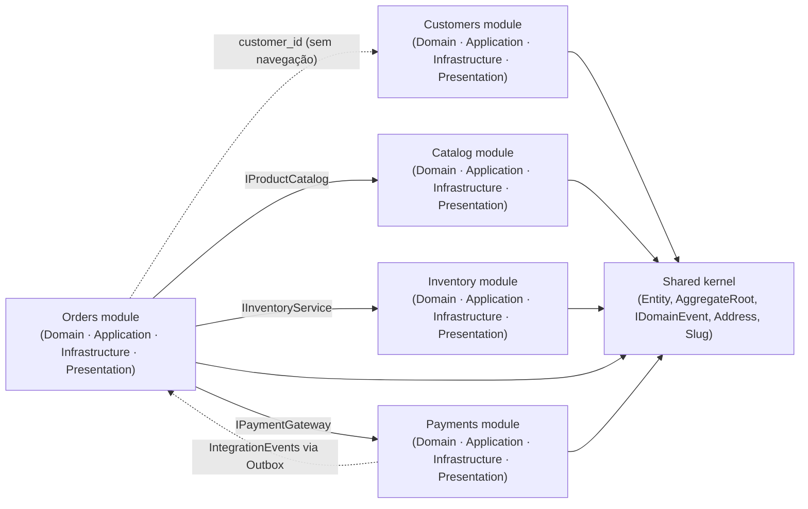

# Visão geral dos módulos

Diagrama leve, só com a direção de dependência entre módulos (via Application Contracts, nunca acessando Domain/Infrastructure alheios). Serve como mapa para navegar até o diagrama detalhado de cada módulo.

## Diagramas detalhados (um por módulo, cada um pequeno o suficiente para renderizar)

1. [Shared kernel](01-shared-kernel.md) — `Entity`, `AggregateRoot`, `IDomainEvent`, value objects, dispatcher de eventos.
2. [Customers](02-customers.md) — cliente, endereços, métodos de pagamento salvos.
3. [Catalog](03-catalog.md) — categorias, produtos, imagens, variações.
4. [Inventory](04-inventory.md) — saldo de estoque e reservas.
5. [Orders](05-orders.md) — pedido, itens, ciclo de vida, adapters para os outros módulos.
6. [Payments](06-payments.md) — pagamento, estornos, outbox de eventos de integração.

Cada arquivo é autocontido: quando um módulo depende de outro (ex.: Orders → Catalog), a classe externa aparece como um "stub" marcado `<<external>>`, só com a assinatura que importa para aquele módulo — o detalhe completo dela está no arquivo do módulo dono.
