# Módulo Customers

```mermaid

classDiagram
    direction LR

    class AggregateRoot~TId~ {
        <<external>>
    }

    class Address {
        <<external>>
    }

    %% OrderCore.Api.Modules.Customers.Domain.Entities
    class Customer {
        +string Name
        +string Email
        +string? Phone
        +string? DocumentNumber
        +bool Active
        +DateTimeOffset? EmailVerifiedAt
        +DateTimeOffset CreatedAt
        +DateTimeOffset UpdatedAt
        +IReadOnlyCollection~CustomerAddress~ Addresses
        +IReadOnlyCollection~CustomerPaymentMethod~ PaymentMethods
        +Create(string name, string email)$ Customer
        +UpdateProfile(string name, string? phone, string? documentNumber) void
        +VerifyEmail(DateTimeOffset now) void
        +Activate() void
        +Deactivate() void
        +AddAddress(CustomerAddress address) void
        +RemoveAddress(Guid addressId) void
        +SetDefaultShippingAddress(Guid addressId) void
        +SetDefaultBillingAddress(Guid addressId) void
        +AddPaymentMethod(CustomerPaymentMethod method) void
        +RemovePaymentMethod(Guid paymentMethodId) void
    }

    class CustomerAddress {
        +string Label
        +string RecipientName
        +string? Phone
        +Address Address
        +bool IsDefaultShipping
        +bool IsDefaultBilling
        +DateTimeOffset CreatedAt
    }

    class CustomerPaymentMethod {
        +string Provider
        +string ProviderCustomerReference
        +string Brand
        +string Last4Digits
        +int ExpiryMonth
        +int ExpiryYear
        +bool IsDefault
        +DateTimeOffset CreatedAt
    }


    %% OrderCore.Api.Modules.Customers.Domain.Events
    class CustomerRegistered {
        +Guid EventId
        +DateTimeOffset OccurredAt
        +Guid CustomerId
        +string Email
    }

    class CustomerAddressAdded {
        +Guid EventId
        +DateTimeOffset OccurredAt
        +Guid CustomerId
        +Guid AddressId
    }


    %% OrderCore.Api.Modules.Customers.Application.Contracts
    class ICustomerRepository {
        <<interface>>
        +GetByIdAsync(Guid customerId) Task~Customer?~
        +GetByEmailAsync(string email) Task~Customer?~
        +AddAsync(Customer customer) Task
        +SaveChangesAsync() Task
    }


    %% OrderCore.Api.Modules.Customers.Application.DTOs
    class RegisterCustomerCommand {
        +string Name
        +string Email
        +string? Phone
        +string? DocumentNumber
    }

    class AddCustomerAddressCommand {
        +Guid CustomerId
        +string Label
        +string RecipientName
        +Address Address
    }

    class CustomerOutput {
        +Guid Id
        +string Name
        +string Email
        +bool Active
    }


    %% OrderCore.Api.Modules.Customers.Application.UseCases
    class RegisterCustomerUseCase {
        -ICustomerRepository customers
        +ExecuteAsync(RegisterCustomerCommand command) Task~CustomerOutput~
    }

    class UpdateCustomerProfileUseCase {
        -ICustomerRepository customers
        +ExecuteAsync(Guid customerId, string name, string? phone) Task~CustomerOutput~
    }

    class AddCustomerAddressUseCase {
        -ICustomerRepository customers
        +ExecuteAsync(AddCustomerAddressCommand command) Task~Guid~
    }

    class ListCustomerAddressesUseCase {
        -ICustomerRepository customers
        +ExecuteAsync(Guid customerId) Task~IReadOnlyList~CustomerAddress~~
    }

    class GetCustomerByIdUseCase {
        -ICustomerRepository customers
        +ExecuteAsync(Guid customerId) Task~CustomerOutput~
    }


    %% OrderCore.Api.Modules.Customers
    class CustomersDependencyInjection {
        <<static>>
        +AddCustomersModule(IServiceCollection services)$ IServiceCollection
    }


    %% OrderCore.Api.Modules.Customers.Infrastructure.Persistence
    class CustomerPersistenceModel {
        +Guid Id
        +string Name
        +string Email
        +string? Phone
        +bool Active
        +DateTimeOffset CreatedAt
        +DateTimeOffset UpdatedAt
        +ICollection~CustomerAddressPersistenceModel~ Addresses
        +ICollection~CustomerPaymentMethodPersistenceModel~ PaymentMethods
    }

    class CustomerAddressPersistenceModel {
        +Guid Id
        +Guid CustomerId
        +string Label
        +string Street
        +string City
        +string State
        +string PostalCode
        +bool IsDefaultShipping
        +bool IsDefaultBilling
    }

    class CustomerPaymentMethodPersistenceModel {
        +Guid Id
        +Guid CustomerId
        +string Provider
        +string Brand
        +string Last4Digits
        +bool IsDefault
    }

    class CustomerMapper {
        +ToDomain(CustomerPersistenceModel model) Customer
        +ToPersistence(Customer domain) CustomerPersistenceModel
        +ApplyChanges(Customer domain, CustomerPersistenceModel model) void
    }

    class CustomersDbContext {
        +DbSet~CustomerPersistenceModel~ Customers
        +DbSet~CustomerAddressPersistenceModel~ CustomerAddresses
        +DbSet~CustomerPaymentMethodPersistenceModel~ CustomerPaymentMethods
        +SaveChangesAsync() Task~int~
    }

    class EfCustomerRepository {
        -CustomersDbContext dbContext
        -CustomerMapper mapper
    }


    %% OrderCore.Api.Modules.Customers.Presentation
    class CustomersEndpoints {
        <<static>>
        +MapCustomersEndpoints(IEndpointRouteBuilder app)$ IEndpointRouteBuilder
        +RegisterAsync(RegisterCustomerRequest request, RegisterCustomerUseCase useCase) Task~IResult~
        +GetByIdAsync(Guid id, GetCustomerByIdUseCase useCase) Task~IResult~
        +AddAddressAsync(Guid id, AddCustomerAddressRequest request, AddCustomerAddressUseCase useCase) Task~IResult~
        +ListAddressesAsync(Guid id, ListCustomerAddressesUseCase useCase) Task~IResult~
    }

    class RegisterCustomerRequest {
        +string Name
        +string Email
        +string? Phone
    }

    class AddCustomerAddressRequest {
        +string Label
        +string RecipientName
        +string Street
        +string City
        +string State
        +string PostalCode
    }

    class CustomerResponse {
        +Guid Id
        +string Name
        +string Email
        +bool Active
    }

    class CustomerAddressResponse {
        +Guid Id
        +string Label
        +string City
        +bool IsDefaultShipping
    }

    class CustomerPresenter {
        +ToResponse(CustomerOutput output) CustomerResponse
        +ToResponse(CustomerAddress address) CustomerAddressResponse
    }


    AggregateRoot~TId~ <|-- Customer
    IDomainEvent <|.. CustomerRegistered
    IDomainEvent <|.. CustomerAddressAdded
    Customer "1" *-- "0..*" CustomerAddress
    Customer "1" *-- "0..*" CustomerPaymentMethod
    CustomerAddress --> Address
    Customer ..> CustomerRegistered : raises
    Customer ..> CustomerAddressAdded : raises

    RegisterCustomerUseCase --> ICustomerRepository
    UpdateCustomerProfileUseCase --> ICustomerRepository
    AddCustomerAddressUseCase --> ICustomerRepository
    GetCustomerByIdUseCase --> ICustomerRepository
    ListCustomerAddressesUseCase --> ICustomerRepository

    ICustomerRepository <|.. EfCustomerRepository
    EfCustomerRepository --> CustomersDbContext
    EfCustomerRepository --> CustomerMapper
    CustomerMapper --> CustomerPersistenceModel
    CustomerMapper --> Customer
    CustomersDbContext --> CustomerPersistenceModel
    CustomersDbContext --> CustomerAddressPersistenceModel
    CustomersDbContext --> CustomerPaymentMethodPersistenceModel

    CustomersDependencyInjection --> RegisterCustomerUseCase : registers
    CustomersDependencyInjection --> ICustomerRepository : registers

    CustomersEndpoints --> RegisterCustomerUseCase
    CustomersEndpoints --> GetCustomerByIdUseCase
    CustomersEndpoints --> AddCustomerAddressUseCase
    CustomersEndpoints --> ListCustomerAddressesUseCase
    CustomersEndpoints --> CustomerPresenter
    CustomerPresenter --> CustomerResponse
    CustomerPresenter --> CustomerAddressResponse

```

Cadastro de clientes, endereços salvos e métodos de pagamento tokenizados. Base: [Shared kernel](01-shared-kernel.md) (`AggregateRoot<Guid>`, `Address`).

## Consumido por outros módulos

- Nenhum outro módulo referencia `Customer` diretamente — `Order.CustomerId` guarda apenas o id (ver [05-orders.md](05-orders.md)), seguindo a mesma regra de isolamento que já existe entre Orders e Payments no código atual.
