# Módulo Orders

```mermaid

classDiagram
    direction LR

    class AggregateRoot~TId~ {
        <<external>>
    }

    class Address {
        <<external>>
    }

    class IDomainEventDispatcher {
        <<external>>
        <<interface>>
    }

    class IProductRepository {
        <<external>>
        <<interface>>
    }

    class ReserveStockUseCase {
        <<external>>
    }

    class ReleaseReservationUseCase {
        <<external>>
    }

    class ConsumeReservationUseCase {
        <<external>>
    }

    class IInventoryReservationRepository {
        <<external>>
        <<interface>>
    }

    class CreatePaymentUseCase {
        <<external>>
    }

    class PaymentAuthorized {
        <<external>>
    }

    class PaymentFailed {
        <<external>>
    }

    note for IProductRepository "Catalog module — ver 03-catalog.md"
    note for ReserveStockUseCase "Inventory module — ver 04-inventory.md"
    note for ReleaseReservationUseCase "Inventory module — ver 04-inventory.md"
    note for ConsumeReservationUseCase "Inventory module — ver 04-inventory.md"
    note for IInventoryReservationRepository "Inventory module — ver 04-inventory.md"
    note for CreatePaymentUseCase "Payments module — ver 06-payments.md"
    note for PaymentAuthorized "Payments module — ver 06-payments.md"
    note for PaymentFailed "Payments module — ver 06-payments.md"

    %% OrderCore.Api.Modules.Orders.Domain.Entities
    class Order {
        +string OrderNumber
        +Guid CustomerId
        +OrderStatus Status
        +IReadOnlyCollection~OrderItem~ Items
        +decimal SubtotalAmount
        +decimal DiscountAmount
        +decimal ShippingAmount
        +decimal TaxAmount
        +decimal TotalAmount
        +string Currency
        +Address? ShippingAddress
        +Address? BillingAddress
        +string? CustomerNotes
        +string? InternalNotes
        +DateTimeOffset CreatedAt
        +DateTimeOffset UpdatedAt
        +DateTimeOffset? ConfirmedAt
        +DateTimeOffset? CancelledAt
        +DateTimeOffset? ShippedAt
        +DateTimeOffset? DeliveredAt
        +Create(Guid customerId, string currency, string orderNumber, DateTimeOffset now)$ Order
        +AddItem(Guid productId, Guid? productVariantId, string productSku, string productName, string? productImageUrl, decimal unitPrice, int quantity) void
        +RemoveItem(Guid productId) void
        +SetAddresses(Address shippingAddress, Address billingAddress) void
        +SetInternalNotes(string? notes) void
        +ApplyDiscount(decimal amount) void
        +SetShippingAmount(decimal amount) void
        +SetTaxAmount(decimal amount) void
        +RequestPayment(DateTimeOffset now) void
        +Confirm(DateTimeOffset now) void
        +StartProcessing(DateTimeOffset now) void
        +Ship(DateTimeOffset now) void
        +Deliver(DateTimeOffset now) void
        +FailPayment(string reason, DateTimeOffset now) void
        +Cancel(string reason, DateTimeOffset now) void
    }

    class OrderItem {
        +Guid ProductId
        +Guid? ProductVariantId
        +string ProductSku
        +string ProductName
        +string? ProductImageUrl
        +decimal UnitPrice
        +int Quantity
        +decimal DiscountAmount
        +decimal Total
        +IncreaseQuantity(int quantity) void
        +DecreaseQuantity(int quantity) void
        +ApplyDiscount(decimal amount) void
    }


    %% OrderCore.Api.Modules.Orders.Domain.Enums
    class OrderStatus {
        <<enumeration>>
        Created
        PendingPayment
        Confirmed
        Processing
        Shipped
        Delivered
        PaymentFailed
        Cancelled
    }


    %% OrderCore.Api.Modules.Orders.Domain.Events
    class OrderCreated {
        +Guid EventId
        +DateTimeOffset OccurredAt
        +Guid OrderId
        +Guid CustomerId
    }

    class OrderConfirmed {
        +Guid EventId
        +DateTimeOffset OccurredAt
        +Guid OrderId
    }

    class OrderCancelled {
        +Guid EventId
        +DateTimeOffset OccurredAt
        +Guid OrderId
        +string Reason
    }

    class OrderPaymentFailed {
        +Guid EventId
        +DateTimeOffset OccurredAt
        +Guid OrderId
        +string Reason
    }


    %% OrderCore.Api.Modules.Orders.Application.Contracts
    class IOrderRepository {
        <<interface>>
        +GetByIdAsync(Guid orderId) Task~Order?~
        +AddAsync(Order order) Task
        +SaveChangesAsync() Task
    }

    class IProductCatalog {
        <<interface>>
        +GetAsync(Guid productId) Task~Product?~
    }

    class IInventoryService {
        <<interface>>
        +TryReserveOrderItemsAsync(Order order) Task~bool~
        +ReleaseReservationsAsync(Guid orderId) Task
        +ConsumeReservationsAsync(Guid orderId) Task
    }

    class IPaymentGateway {
        <<interface>>
        +RequestPaymentAsync(Guid orderId, decimal amount, string currency, string idempotencyKey) Task~Guid~
    }

    class IOrderNumberGenerator {
        <<interface>>
        +NextAsync() Task~string~
    }


    %% OrderCore.Api.Modules.Orders.Application.DTOs
    class CreateOrderItem {
        +Guid ProductId
        +int Quantity
    }

    class CreateOrderCommand {
        +Guid CustomerId
        +string Currency
        +IReadOnlyCollection~CreateOrderItem~ Items
    }

    class CreateOrderResult {
        +Guid OrderId
        +decimal TotalAmount
        +string Status
    }

    class SetOrderAddressesCommand {
        +Guid OrderId
        +Address ShippingAddress
        +Address BillingAddress
    }

    class CancelOrderCommand {
        +Guid OrderId
        +string Reason
    }


    %% OrderCore.Api.Modules.Orders.Application.UseCases
    class CreateOrderHandler {
        -IOrderRepository orderRepository
        -IProductCatalog productCatalog
        -IOrderNumberGenerator orderNumbers
        -TimeProvider timeProvider
        +HandleAsync(CreateOrderCommand command) Task~CreateOrderResult~
    }

    class SetOrderAddressesUseCase {
        -IOrderRepository orderRepository
        +ExecuteAsync(SetOrderAddressesCommand command) Task
    }

    class RequestOrderPaymentUseCase {
        -IOrderRepository orderRepository
        -IInventoryService inventoryService
        -IPaymentGateway paymentGateway
        -TimeProvider timeProvider
        +ExecuteAsync(Guid orderId) Task~CreateOrderResult~
    }

    class ConfirmOrderUseCase {
        -IOrderRepository orderRepository
        -IInventoryService inventoryService
        -TimeProvider timeProvider
        +ExecuteAsync(Guid orderId) Task
    }

    class MarkOrderPaymentFailedUseCase {
        -IOrderRepository orderRepository
        -IInventoryService inventoryService
        -TimeProvider timeProvider
        +ExecuteAsync(Guid orderId, string reason) Task
    }

    class CancelOrderUseCase {
        -IOrderRepository orderRepository
        -IInventoryService inventoryService
        -TimeProvider timeProvider
        +ExecuteAsync(CancelOrderCommand command) Task
    }

    class GetOrderByIdUseCase {
        -IOrderRepository orderRepository
        +ExecuteAsync(Guid orderId) Task~Order?~
    }

    class ListCustomerOrdersUseCase {
        -IOrderRepository orderRepository
        +ExecuteAsync(Guid customerId) Task~IReadOnlyList~Order~~
    }


    %% OrderCore.Api.Modules.Orders
    class OrdersDependencyInjection {
        <<static>>
        +AddOrdersModule(IServiceCollection services)$ IServiceCollection
    }


    %% OrderCore.Api.Modules.Orders.Infrastructure.Persistence
    class OrderPersistenceModel {
        +Guid Id
        +Guid CustomerId
        +string Status
        +decimal SubtotalAmount
        +decimal DiscountAmount
        +decimal ShippingAmount
        +decimal TaxAmount
        +string Currency
        +int Version
        +ICollection~OrderItemPersistenceModel~ Items
    }

    class OrderItemPersistenceModel {
        +Guid Id
        +Guid OrderId
        +Guid ProductId
        +string ProductSku
        +string ProductName
        +decimal UnitPrice
        +int Quantity
    }

    class OrderStatusHistoryPersistenceModel {
        +Guid Id
        +Guid OrderId
        +string FromStatus
        +string ToStatus
        +string? Reason
        +DateTimeOffset ChangedAt
    }

    class OrderMapper {
        +ToDomain(OrderPersistenceModel model) Order
        +ToPersistence(Order domain) OrderPersistenceModel
        +ApplyChanges(Order domain, OrderPersistenceModel model) void
    }

    class OrdersDbContext {
        +DbSet~OrderPersistenceModel~ Orders
        +DbSet~OrderStatusHistoryPersistenceModel~ StatusHistory
        +SaveChangesAsync() Task~int~
    }

    class EfOrderRepository {
        -OrdersDbContext dbContext
        -OrderMapper mapper
        -IDomainEventDispatcher dispatcher
    }

    class SequentialOrderNumberGenerator {
        -OrdersDbContext dbContext
        +NextAsync() Task~string~
    }


    %% OrderCore.Api.Modules.Orders.Infrastructure.Adapters
    class ProductCatalogAdapter {
        -IProductRepository catalogProducts
        +GetAsync(Guid productId) Task~Product?~
    }

    class InventoryServiceAdapter {
        -ReserveStockUseCase reserveStock
        -ReleaseReservationUseCase releaseReservation
        -ConsumeReservationUseCase consumeReservation
        -IInventoryReservationRepository reservations
        +TryReserveOrderItemsAsync(Order order) Task~bool~
        +ReleaseReservationsAsync(Guid orderId) Task
        +ConsumeReservationsAsync(Guid orderId) Task
    }

    class PaymentGatewayAdapter {
        -CreatePaymentUseCase createPayment
        +RequestPaymentAsync(Guid orderId, decimal amount, string currency, string idempotencyKey) Task~Guid~
    }


    %% OrderCore.Api.Modules.Orders.Infrastructure.EventHandlers
    class OrderStatusHistoryProjector {
        -OrdersDbContext dbContext
        +HandleAsync(OrderCreated domainEvent) Task
        +HandleAsync(OrderConfirmed domainEvent) Task
        +HandleAsync(OrderCancelled domainEvent) Task
        +HandleAsync(OrderPaymentFailed domainEvent) Task
    }


    %% OrderCore.Api.Modules.Orders.Infrastructure.IntegrationEventHandlers
    class PaymentAuthorizedIntegrationEventHandler {
        -ConfirmOrderUseCase confirmOrder
        +HandleAsync(PaymentAuthorized integrationEvent) Task
    }

    class PaymentFailedIntegrationEventHandler {
        -MarkOrderPaymentFailedUseCase markPaymentFailed
        +HandleAsync(PaymentFailed integrationEvent) Task
    }


    %% OrderCore.Api.Modules.Orders.Presentation
    class OrdersEndpoints {
        <<static>>
        +MapOrdersEndpoints(IEndpointRouteBuilder app)$ IEndpointRouteBuilder
        +CreateOrderAsync(CreateOrderRequest request, CreateOrderHandler handler) Task~IResult~
        +SetAddressesAsync(Guid id, SetOrderAddressesRequest request, SetOrderAddressesUseCase useCase) Task~IResult~
        +RequestPaymentAsync(Guid id, RequestOrderPaymentUseCase useCase) Task~IResult~
        +GetByIdAsync(Guid id, GetOrderByIdUseCase useCase) Task~IResult~
        +ListByCustomerAsync(Guid customerId, ListCustomerOrdersUseCase useCase) Task~IResult~
        +CancelAsync(Guid id, CancelOrderRequest request, CancelOrderUseCase useCase) Task~IResult~
    }

    class CreateOrderItemRequest {
        +Guid ProductId
        +int Quantity
    }

    class CreateOrderRequest {
        +Guid CustomerId
        +string Currency
        +IReadOnlyCollection~CreateOrderItemRequest~ Items
    }

    class SetOrderAddressesRequest {
        +string ShippingStreet
        +string ShippingCity
        +string BillingStreet
        +string BillingCity
    }

    class CancelOrderRequest {
        +string Reason
    }

    class OrderItemResponse {
        +Guid ProductId
        +string ProductName
        +decimal UnitPrice
        +int Quantity
        +decimal Total
    }

    class OrderResponse {
        +Guid Id
        +string OrderNumber
        +string Status
        +decimal TotalAmount
        +string Currency
        +IReadOnlyList~OrderItemResponse~ Items
    }

    class OrderPresenter {
        +ToResponse(Order order) OrderResponse
        +ToResponse(CreateOrderResult result) OrderResponse
    }


    AggregateRoot~TId~ <|-- Order
    Order "1" *-- "1..*" OrderItem
    Order --> OrderStatus
    Order --> Address : ShippingAddress/BillingAddress
    Order ..> OrderCreated : raises
    Order ..> OrderConfirmed : raises
    Order ..> OrderCancelled : raises
    Order ..> OrderPaymentFailed : raises

    CreateOrderHandler --> IOrderRepository
    CreateOrderHandler --> IProductCatalog
    CreateOrderHandler --> IOrderNumberGenerator
    CreateOrderHandler ..> Order : creates
    SetOrderAddressesUseCase --> IOrderRepository
    RequestOrderPaymentUseCase --> IOrderRepository
    RequestOrderPaymentUseCase --> IInventoryService
    RequestOrderPaymentUseCase --> IPaymentGateway
    ConfirmOrderUseCase --> IOrderRepository
    ConfirmOrderUseCase --> IInventoryService
    MarkOrderPaymentFailedUseCase --> IOrderRepository
    MarkOrderPaymentFailedUseCase --> IInventoryService
    CancelOrderUseCase --> IOrderRepository
    CancelOrderUseCase --> IInventoryService
    GetOrderByIdUseCase --> IOrderRepository
    ListCustomerOrdersUseCase --> IOrderRepository
    CreateOrderCommand "1" *-- "1..*" CreateOrderItem

    IOrderRepository <|.. EfOrderRepository
    EfOrderRepository --> OrdersDbContext
    EfOrderRepository --> OrderMapper
    EfOrderRepository --> IDomainEventDispatcher : dispatches after save
    IOrderNumberGenerator <|.. SequentialOrderNumberGenerator
    SequentialOrderNumberGenerator --> OrdersDbContext
    OrderMapper --> OrderPersistenceModel
    OrderMapper --> Order
    OrdersDbContext --> OrderPersistenceModel
    OrdersDbContext --> OrderStatusHistoryPersistenceModel

    IProductCatalog <|.. ProductCatalogAdapter
    ProductCatalogAdapter --> IProductRepository : reads Catalog module
    IInventoryService <|.. InventoryServiceAdapter
    InventoryServiceAdapter --> ReserveStockUseCase
    InventoryServiceAdapter --> ReleaseReservationUseCase
    InventoryServiceAdapter --> ConsumeReservationUseCase
    InventoryServiceAdapter --> IInventoryReservationRepository
    IPaymentGateway <|.. PaymentGatewayAdapter
    PaymentGatewayAdapter --> CreatePaymentUseCase

    OrderStatusHistoryProjector --> OrdersDbContext
    PaymentAuthorizedIntegrationEventHandler --> ConfirmOrderUseCase
    PaymentFailedIntegrationEventHandler --> MarkOrderPaymentFailedUseCase

    OrdersDependencyInjection --> CreateOrderHandler : registers
    OrdersDependencyInjection --> IOrderRepository : registers
    OrdersDependencyInjection --> IOrderNumberGenerator : registers

    OrdersEndpoints --> CreateOrderHandler
    OrdersEndpoints --> SetOrderAddressesUseCase
    OrdersEndpoints --> RequestOrderPaymentUseCase
    OrdersEndpoints --> GetOrderByIdUseCase
    OrdersEndpoints --> ListCustomerOrdersUseCase
    OrdersEndpoints --> CancelOrderUseCase
    OrdersEndpoints --> OrderPresenter
    OrderPresenter --> OrderResponse

```

Agregado principal do sistema (já parcialmente implementado). Este diagrama inclui os *adapters* que o próprio módulo Orders usa para falar com Catalog, Inventory e Payments sem depender do Domain/Infrastructure interno deles — só das classes externas marcadas `<<external>>` (o detalhe completo de cada uma está no arquivo do módulo dono). Base: [Shared kernel](01-shared-kernel.md).

## Comportamento de OrderItem

`OrderItem` ganhou `DecreaseQuantity` (simétrico ao `IncreaseQuantity` já existente — sem ele, reduzir a quantidade de uma linha exigia remover e recriar o item inteiro) e `ApplyDiscount(decimal amount)`, que deve validar `0 <= amount <= UnitPrice * Quantity` antes de aceitar o desconto — a propriedade `DiscountAmount` só deve mudar através desse método, nunca setada diretamente. `Total` passa a ser `UnitPrice * Quantity - DiscountAmount`.

## Paridade com `docs/database/OrderCore_Modelagem_Banco_Backend.docx`

O documento de modelagem de banco já especificava `internal_notes` e `updated_at` em `ORDERS` (seção 6.1) e `product_variant_id` em `ORDER_ITEMS` (seção 6.2), mas nenhum tinha chegado a este diagrama. Adicionados agora: `InternalNotes` ganhou `SetInternalNotes` como único jeito de alterá-lo (mesmo padrão de encapsulamento do resto do agregado); `UpdatedAt` fica por conta da camada de persistência a cada gravação, sem entrar na assinatura dos métodos de transição; `ProductVariantId` foi ao mesmo tempo adicionado em `OrderItem` e no parâmetro de `Order.AddItem`, já que é o único lugar onde um `OrderItem` é construído.

`OrderNumber`, `ShippedAt` e `DeliveredAt` não existiam em nenhum dos dois documentos — acrescentados em ambos agora. `Id` (Guid) não é algo que se mostre a um cliente numa confirmação de pedido; `OrderNumber` é o identificador legível (ex.: `"ORD-2024-000123"`), gerado por `IOrderNumberGenerator` (novo contrato, com `SequentialOrderNumberGenerator` como implementação apoiada numa sequence do PostgreSQL) e passado para `Order.Create`. `ShippedAt`/`DeliveredAt` seguem o mesmo raciocínio de `ConfirmedAt`/`CancelledAt`: são os dois status mais relevantes para uma tela de acompanhamento do cliente, então ganham timestamp próprio em vez de depender só do histórico (`ORDER_STATUS_HISTORY`); `Ship`/`Deliver` já recebiam `now`, então nenhuma assinatura precisou mudar.

## Fluxo de checkout (leitura sugerida)

`CreateOrderHandler` → `RequestOrderPaymentUseCase` (reserva estoque via `InventoryServiceAdapter`, depois solicita pagamento via `PaymentGatewayAdapter`) → `PaymentAuthorizedIntegrationEventHandler`/`PaymentFailedIntegrationEventHandler` (recebem o resultado assíncrono do módulo Payments — ver [06-payments.md](06-payments.md) — e chamam `ConfirmOrderUseCase`/`MarkOrderPaymentFailedUseCase`).
